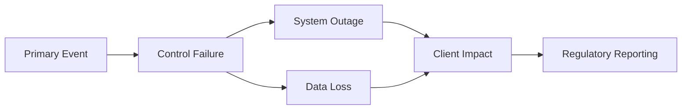

# Impact Analysis

Impact analysis in NFR Connect quantifies the potential consequences of risk events across multiple dimensions.

## Impact Dimensions

| Dimension | Metrics | Weight |
|-----------|---------|--------|
| Financial | Direct loss, remediation cost | 40% |
| Operational | Service disruption, productivity | 25% |
| Regulatory | Fines, sanctions, compliance gaps | 20% |
| Reputational | Client impact, media exposure | 15% |

## Quantitative Assessment

The total impact score is calculated as a weighted sum:

$$
I_{total} = \sum_{i=1}^{n} w_i \cdot I_i
$$

Where:
- $I_{total}$ is the total impact score
- $w_i$ is the weight for dimension $i$
- $I_i$ is the impact score for dimension $i$ (1-5 scale)

### Example Calculation

For a data breach event:

| Dimension | Score | Weight | Weighted |
|-----------|-------|--------|----------|
| Financial | 4 | 0.40 | 1.60 |
| Operational | 3 | 0.25 | 0.75 |
| Regulatory | 5 | 0.20 | 1.00 |
| Reputational | 4 | 0.15 | 0.60 |
| **Total** | | | **3.95** |

## Impact Propagation

NFR Connect uses graph analysis to identify cascading impacts:

:::info HALO Model
The **HALO** (Hypergraph Analysis of Linked Objects) model identifies multi-hop risk propagation paths, revealing hidden dependencies and systemic risks.
:::

## Capital at Risk (CaR)

For significant events, NFR Connect calculates the Capital at Risk:

$$
CaR = VaR_{99.9\%} \times \sqrt{\frac{t}{252}}
$$

Where:
- $VaR_{99.9\%}$ is the Value at Risk at 99.9% confidence
- $t$ is the time horizon in days
- 252 is the number of trading days per year

This metric is used for regulatory capital allocation and stress testing scenarios.
