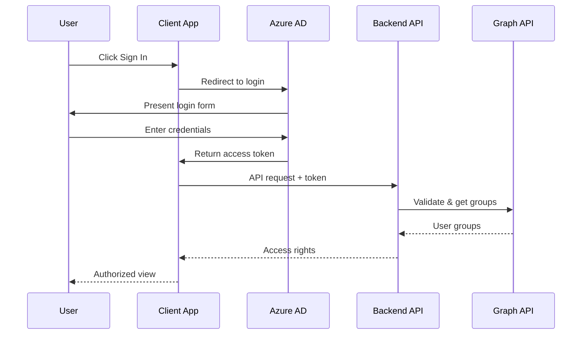

# Authentication

NFR Connect uses Microsoft Azure Active Directory (Azure AD) for secure enterprise authentication.

## Authentication Flow



## Access Control

NFR Connect implements role-based access control through Azure AD groups:

| Access Right | Azure AD Group | Features |
|--------------|----------------|----------|
| `hasChatAccess` | NFR-Chat-Users | Agentic chat interface |
| `hasDashboardAccess` | NFR-Dashboard-Users | Analytics dashboard |

## Configuration

### Client Configuration

The authentication configuration is managed in `authConfig.ts`:

```typescript title="client/src/config/authConfig.ts"
export const msalConfig = {
  auth: {
    clientId: process.env.REACT_APP_CLIENT_ID,
    authority: process.env.REACT_APP_AUTHORITY,
    redirectUri: process.env.REACT_APP_REDIRECT_URI,
  },
  cache: {
    cacheLocation: 'sessionStorage',
    storeAuthStateInCookie: false,
  },
};

export const loginRequest = {
  scopes: ['User.Read'],
};
```

### Server Configuration

The backend validates tokens and checks group membership:

```python title="server/main.py"
@app.get("/api/auth/access")
async def check_access(token: str = Depends(oauth2_scheme)):
    # Validate token and get user groups
    groups = await get_user_groups(token)

    return {
        "hasChatAccess": CHAT_GROUP_ID in groups,
        "hasDashboardAccess": DASHBOARD_GROUP_ID in groups,
        "user": get_user_display_name(token)
    }
```

## Troubleshooting

<Warning title="Common Issues">
**"AADSTS50011: The reply URL specified in the request does not match"**
- Ensure `REACT_APP_REDIRECT_URI` matches the registered redirect URI in Azure AD

**"User is not authorized"**
- Verify the user is a member of the required Azure AD groups
- Check that group IDs in server `.env` are correct
</Warning>

## Security Best Practices

1. **Never expose client secrets** in frontend code
2. **Use secure token storage** - NFR Connect uses sessionStorage
3. **Implement token refresh** - Tokens are automatically refreshed before expiry
4. **Validate tokens server-side** - All API requests are validated against Azure AD
