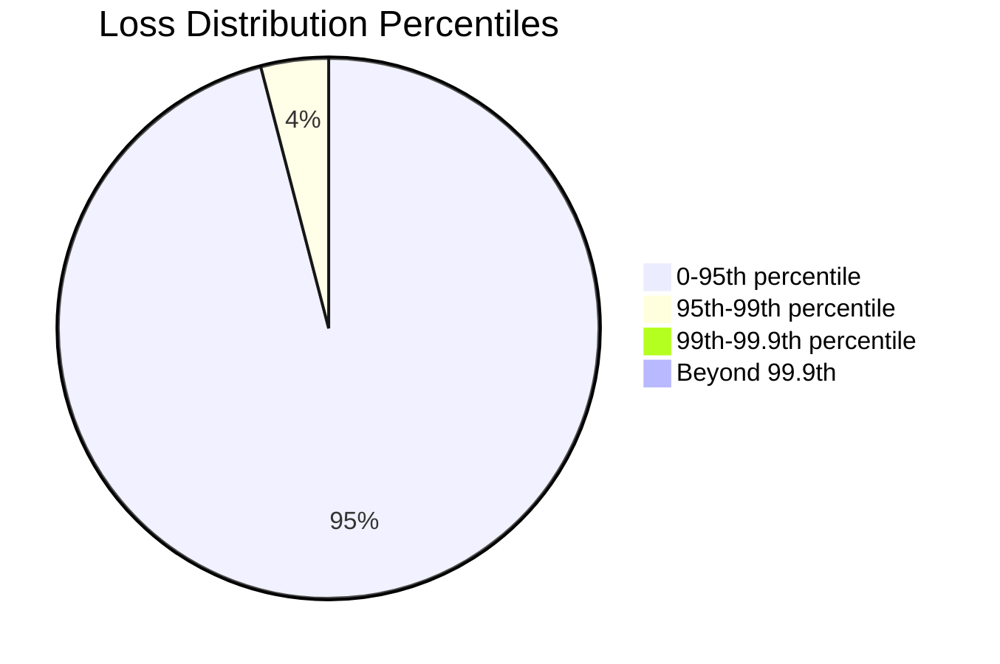

# Monte Carlo Simulations

Monte Carlo simulations provide probabilistic estimates of risk metrics through repeated random sampling.

## Methodology

The Monte Carlo approach generates thousands of possible outcomes to estimate the distribution of risk:

$$
\hat{\mu} = \frac{1}{N} \sum_{i=1}^{N} f(X_i)
$$

Where:
- $\hat{\mu}$ is the estimated mean outcome
- $N$ is the number of simulation iterations
- $f(X_i)$ is the outcome function for sample $i$

## Simulation Parameters

| Parameter | Default | Range | Description |
|-----------|---------|-------|-------------|
| `iterations` | 10,000 | 1,000 - 1,000,000 | Number of simulation runs |
| `confidence` | 99.9% | 95% - 99.99% | VaR confidence level |
| `seed` | random | any integer | Random seed for reproducibility |
| `distribution` | normal | normal, t, empirical | Loss distribution type |

## Configuration Example

```json title="monte-carlo-config.json"
{
  "model": "urn:ubs:nfr:model:mc-oprisk",
  "parameters": {
    "iterations": 100000,
    "confidence_levels": [0.95, 0.99, 0.999],
    "distribution": {
      "type": "generalized_pareto",
      "params": {
        "shape": 0.5,
        "scale": 1000000
      }
    },
    "correlation_method": "gaussian_copula"
  }
}
```

## Output Metrics

The simulation produces:



### Key Outputs

| Metric | Formula | Description |
|--------|---------|-------------|
| VaR | $VaR_\alpha = F^{-1}(\alpha)$ | Value at Risk at confidence α |
| ES | $ES_\alpha = E[L \| L > VaR_\alpha]$ | Expected Shortfall (CVaR) |
| Std Dev | $\sigma = \sqrt{Var(L)}$ | Loss volatility |

## Performance Optimization

For large-scale simulations:

1. **Parallel Processing**: Utilize multi-core execution
2. **Variance Reduction**: Apply antithetic variates
3. **GPU Acceleration**: Enable CUDA for matrix operations

<Warning title="Computation Time">
Simulations with >100,000 iterations may take several minutes. Use the async API for long-running jobs.
</Warning>

```python title="Async simulation example"
# Submit async job
job = await client.post('/api/simulations/submit', json=config)
job_id = job['id']

# Poll for completion
while True:
    status = await client.get(f'/api/simulations/{job_id}/status')
    if status['complete']:
        break
    await asyncio.sleep(5)

# Retrieve results
results = await client.get(f'/api/simulations/{job_id}/results')
```
