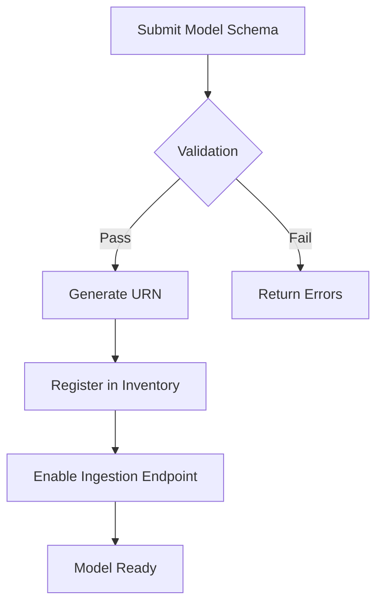

# Risk Model Integration

Learn how to programmatically integrate external risk calculation models with the NFR Connect ingestion engine using the standardized model definition schema.

<Warning title="Deprecation Notice">
The `v1.2` schema will be deprecated on Dec 31, 2024. Please migrate to schema `v2.0` for all new integrations.
</Warning>

## Overview

The integration process allows risk quant teams to push model outputs directly into the central operational risk database. This ensures that all [Capital at Risk (CaR)](/core-concepts/impact-analysis#capital-at-risk-car) calculations are synchronized across the explorer in real-time.

Models are identified by a unique URN and must be registered in the Model Inventory before data ingestion can occur.

<Info title="Prerequisites">
- API Token with `write:models` scope
- Whitelisted IP address for the sourcing server
</Info>

## Configuration Object

The configuration object defines the model's metadata and expected input parameters.

```json title="model-config.json"
{
  "modelId": "urn:ubs:nfr:model:monte-carlo-oprisk-v4",
  "version": "2.1.0",
  "owner": "Group Risk Analytics",
  "parameters": [
    {
      "name": "iterations",
      "type": "integer",
      "default": 10000,
      "description": "Number of simulation cycles"
    },
    {
      "name": "confidence_interval",
      "type": "float",
      "default": 0.999
    }
  ]
}
```

### Field Definitions

| Field | Type | Description |
|-------|------|-------------|
| `modelId` | string | The unique URN (Uniform Resource Name) assigned by the model governance committee |
| `version` | string | Semantic version following SemVer 2.0 specification |
| `owner` | string | The business unit responsible for model maintenance |
| `parameters` | array | List of configurable input parameters |
| `confidence_interval` | float | Statistical confidence level for the VaR calculation. Must be between 0.90 and 0.9999 |

## Registration Workflow



## API Integration

### Register a Model

```typescript title="Example: Register new model"
const response = await fetch('/api/models/register', {
  method: 'POST',
  headers: {
    'Authorization': `Bearer ${token}`,
    'Content-Type': 'application/json'
  },
  body: JSON.stringify({
    modelId: 'urn:ubs:nfr:model:my-custom-model',
    version: '1.0.0',
    owner: 'Risk Analytics Team',
    schema: modelSchema
  })
});
```

### Push Model Output

```python title="Python example: Push results"
import httpx

async def push_model_results(model_id: str, results: dict):
    async with httpx.AsyncClient() as client:
        response = await client.post(
            f"/api/models/{model_id}/results",
            json={
                "timestamp": datetime.utcnow().isoformat(),
                "outputs": results,
                "metadata": {
                    "run_id": str(uuid4()),
                    "environment": "production"
                }
            },
            headers={"Authorization": f"Bearer {token}"}
        )
        return response.json()
```

## Model Output Schema

All model outputs must conform to the standard output schema:

```json title="output-schema.json"
{
  "$schema": "https://json-schema.org/draft/2020-12/schema",
  "type": "object",
  "required": ["var", "expected_loss", "tail_risk"],
  "properties": {
    "var": {
      "type": "number",
      "description": "Value at Risk at specified confidence"
    },
    "expected_loss": {
      "type": "number",
      "description": "Expected loss amount"
    },
    "tail_risk": {
      "type": "number",
      "description": "Expected shortfall / CVaR"
    }
  }
}
```

<Tip title="Best Practices">
1. Always include a `run_id` for traceability
2. Version your model schemas to enable rollback
3. Implement idempotent submissions to handle retries
4. Monitor model drift using the built-in analytics
</Tip>
