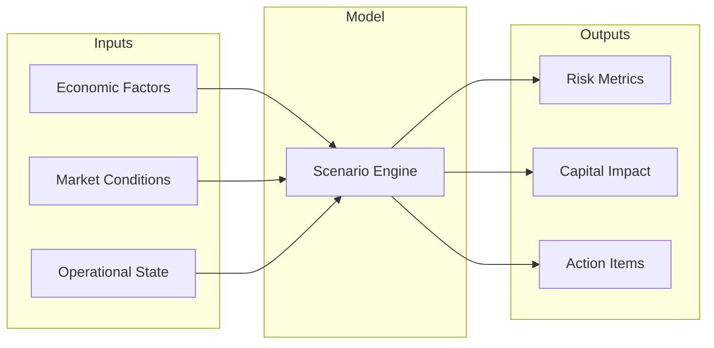

# Scenario Analysis

Scenario analysis enables exploration of risk outcomes under different assumptions and conditions.

## Multi-Factor Scenarios

NFR Connect supports complex scenarios with multiple interacting factors:



## Configuration

### Scenario Definition

```yaml title="scenario-config.yaml"
scenario:
  name: "Rate Shock + Ops Failure"
  factors:
    - type: market
      parameter: interest_rate
      shock: +200bps
    - type: operational
      parameter: system_availability
      shock: -50%
  correlation_matrix:
    - [1.0, 0.3]
    - [0.3, 1.0]
```

## What-If Analysis

The what-if analysis tool allows real-time exploration:

| Parameter | Range | Step |
|-----------|-------|------|
| Interest Rate | -100 to +300 bps | 25 bps |
| FX Volatility | 0.5x to 3.0x | 0.25x |
| Credit Spread | 0 to +500 bps | 50 bps |

<Tip title="Interactive Mode">
Use the Explorer's interactive scenario builder for real-time what-if analysis with instant visual feedback.
</Tip>
