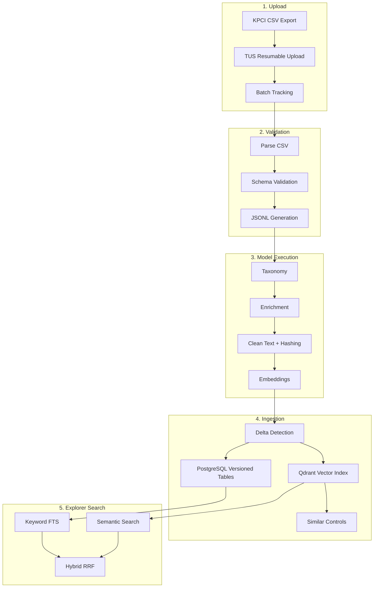
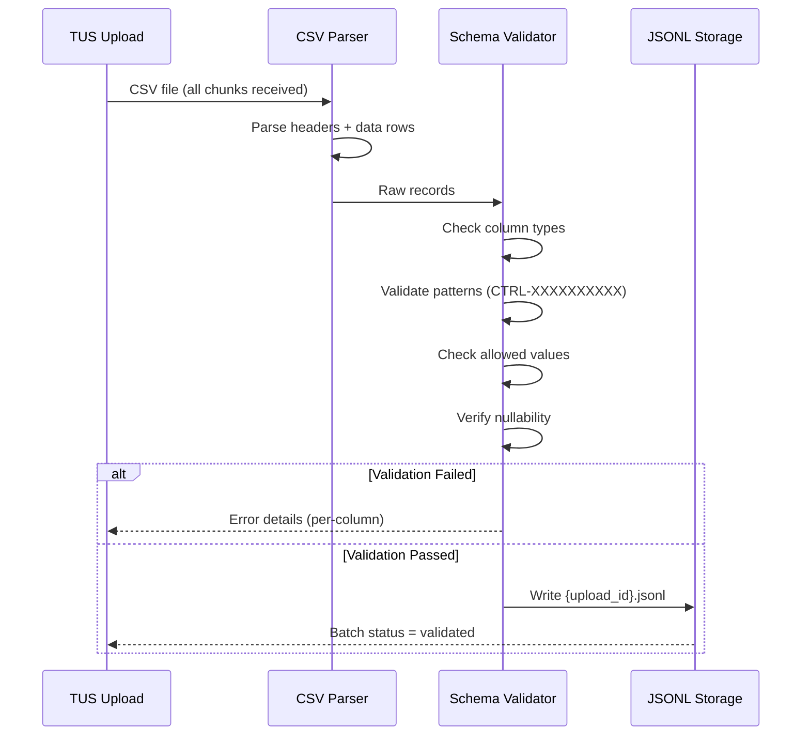
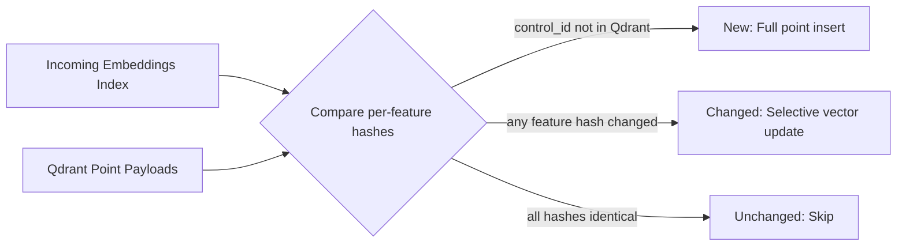
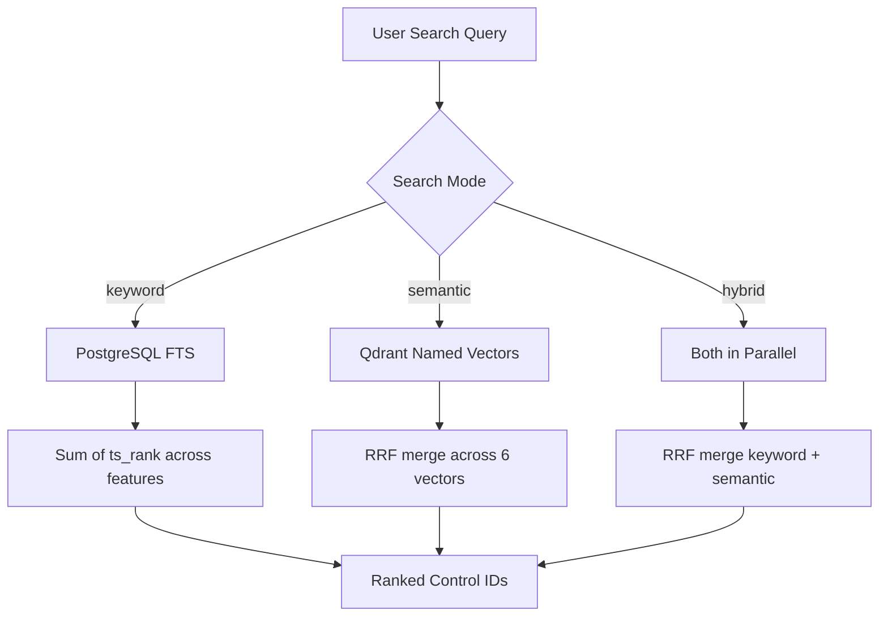
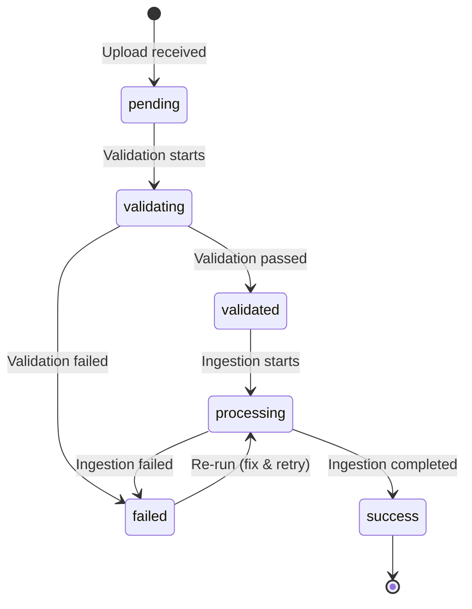

# Controls Pipeline

The Controls pipeline processes Key Performance Controls Inventory (KPCI) data through a multi-stage system: file upload, schema validation, model execution (taxonomy, enrichment, clean text, embeddings), temporal ingestion into PostgreSQL, vector indexing in Qdrant, and precomputed similar-controls scoring.

## Overview



## File Requirements

| Requirement | Value |
|---|---|
| **File Count** | 1 |
| **Format** | CSV (.csv) |
| **Minimum Size** | 5 KB |
| **Maximum Size** | 10 GB |
| **Header Row** | Row 1 |
| **Data Start Row** | Row 2 |

---

## Data Model

### L1/L2 Control Hierarchy

Controls follow a two-level hierarchy that is central to the pipeline's data-sharing and indexing strategy.

| Property | Level 1 | Level 2 |
|---|---|---|
| **Role** | Standard control definition | Localized instance of a Level 1 control |
| **`parent_control_id`** | `NULL` | Points to an L1 control |
| **`control_title`** | Own text | Inherited from parent (~99.9%) |
| **`control_description`** | Own text | Inherited from parent (~99.9%) |
| **`evidence_description`** | Typically empty | Own text (L2-specific) |
| **`local_functional_information`** | Typically empty | Own text (L2-specific) |
| **`control_as_event`** | Own text (if active) | Often inherited from parent |
| **`control_as_issues`** | Own text (if active) | Often inherited from parent |

:::info Data Sharing Pattern
In production data, ~99.9% of Level 2 controls share their `control_title` and `control_description` verbatim with their Level 1 parent. The pipeline's feature mask system detects this inheritance and avoids redundant embedding computation and similarity scoring for inherited fields. See [Feature Masks](#feature-masks) below.
:::

### Entity Relationship Diagram

```mermaid
erDiagram
    src_controls_ref_control ||--o{ src_controls_ver_control : "versions"
    src_controls_ref_control ||--o{ src_controls_rel_parent : "parent edge"
    src_controls_ref_control ||--o{ src_controls_rel_owns_function : "owns"
    src_controls_ref_control ||--o{ src_controls_rel_owns_location : "owns"
    src_controls_ref_control ||--o{ src_controls_rel_related_function : "related"
    src_controls_ref_control ||--o{ src_controls_rel_related_location : "related"
    src_controls_ref_control ||--o{ src_controls_rel_risk_theme : "risk theme"
    src_controls_ref_control ||--o{ ai_controls_model_taxonomy : "taxonomy"
    src_controls_ref_control ||--o{ ai_controls_model_enrichment : "enrichment"
    src_controls_ref_control ||--o{ ai_controls_model_clean_text : "clean text + FTS"
    src_controls_ref_control ||--o{ ai_controls_similar_controls : "similar"

    src_controls_ref_control {
        string control_id PK
        datetime created_at
    }

    src_controls_ver_control {
        bigint ver_id PK
        string ref_control_id FK
        string control_title
        string control_description
        string hierarchy_level
        string control_status
        datetime last_modified_on
        datetime tx_from
        datetime tx_to
    }

    src_controls_rel_parent {
        bigint edge_id PK
        string parent_control_id FK
        string child_control_id FK
        datetime tx_from
        datetime tx_to
    }

    ai_controls_model_clean_text {
        bigint ver_id PK
        string ref_control_id FK
        string control_title
        string control_description
        string hash_control_title
        string hash_control_description
        tsvector ts_control_title
        tsvector ts_control_description
        datetime tx_from
        datetime tx_to
    }
```



### Temporal Versioning

All tables use transaction-time versioning via `tx_from` / `tx_to` columns instead of boolean `is_current` flags.

| Column | Meaning |
|---|---|
| `tx_from` | Timestamp when this version became active |
| `tx_to` | Timestamp when this version was superseded (`NULL` = current) |

**Current version:** `WHERE tx_to IS NULL`
**Historical version:** `WHERE tx_to IS NOT NULL`

When a control changes, the existing row is closed (`tx_to = now()`) and a new row is inserted (`tx_from = now(), tx_to = NULL`).

---

## Processing Stages

### Stage 1: Validation



### Stage 2: Model Execution

Four sequential model stages process the validated controls. Each model reads the source JSONL (and possibly prior model outputs) and writes a separate output file.

```mermaid
flowchart LR
    subgraph Tax["Taxonomy"]
        T1[Load control text]
        T2[Classify NFR risk themes]
        T3[Store taxonomy.jsonl]
    end

    subgraph Enrich["Enrichment"]
        E1[Load control + taxonomy]
        E2[Generate summary + W-criteria]
        E3[Store enrichment.jsonl]
    end

    subgraph Clean["Clean Text"]
        C1[Load control text]
        C2[Normalize + clean 6 features]
        C3[Compute per-feature SHA256 hashes]
        C4[Compute feature masks vs parent]
        C5[Store clean_text.jsonl]
    end

    subgraph Embed["Embeddings"]
        V1[Load clean text + masks]
        V2[Generate 6 embeddings per control]
        V3[Zero vectors for inherited features]
        V4[Store embeddings.npz + index]
    end

    T1 --> T2 --> T3
    T3 --> E1 --> E2 --> E3
    E3 --> C1 --> C2 --> C3 --> C4 --> C5
    C5 --> V1 --> V2 --> V3 --> V4
```



| Model | Input | Output | Key Fields |
|---|---|---|---|
| **Taxonomy** | Source JSONL | `taxonomy.jsonl` | NFR risk theme classifications, reasoning |
| **Enrichment** | Source + taxonomy | `enrichment.jsonl` | Summary, complexity score, W-criteria yes/no flags |
| **Clean Text** | Source JSONL | `clean_text.jsonl` | 6 cleaned text fields, 6 per-feature hashes, 6 feature masks |
| **Embeddings** | Clean text output | `embeddings.npz` + index | 6 named embedding vectors (3072-dim each) |

---

## Per-Feature Hashing

The clean text model computes an independent SHA-256 hash for each of the 6 text features, truncated to a 12-character hex prefix with a `CT` marker.

**Hash Format:** `CT-{sha256[:12]}` (e.g., `CT-a3f8b2c1d4e5`)

**Features hashed:**

| Feature | Hash Column | Typical Source |
|---|---|---|
| `control_title` | `hash_control_title` | L1 own, L2 inherited |
| `control_description` | `hash_control_description` | L1 own, L2 inherited |
| `evidence_description` | `hash_evidence_description` | L2 own, L1 typically empty |
| `local_functional_information` | `hash_local_functional_information` | L2 own, L1 typically empty |
| `control_as_event` | `hash_control_as_event` | Active controls only |
| `control_as_issues` | `hash_control_as_issues` | Active controls only |

Per-feature hashes are used at two points:
1. **Ingestion delta detection** — compare incoming vs. existing hashes in PostgreSQL to detect changed model outputs
2. **Embedding delta detection** — compare incoming vs. existing hashes in Qdrant to selectively update only changed vectors

---

## Feature Masks

Feature masks are boolean flags that indicate whether a feature is **distinguishing** (the control's own text) or **inherited** (copied from its parent).

**Mask Columns:** `mask_control_title`, `mask_control_description`, `mask_evidence_description`, `mask_local_functional_information`, `mask_control_as_event`, `mask_control_as_issues`

### Computation (2-Pass Algorithm)

The clean text model computes masks in two passes:

1. **Pass 1:** Compute per-feature hashes for all controls and build a parent-child map
2. **Pass 2:** For each control, compare its feature hashes against its parent's hashes

```
mask(feature) =
    hash is None           → False  (no text, nothing to distinguish)
    no parent              → True   (L1 controls are always distinguishing)
    hash ≠ parent hash     → True   (child diverges from parent)
    hash = parent hash     → False  (inherited from parent)
```

### How Masks Are Used

| Component | How Masks Are Applied |
|---|---|
| **Embeddings** | `mask=False` → zero vector (no embedding generated for inherited features) |
| **Qdrant Payload** | Masks stored alongside hashes for downstream consumers |
| **Similar Controls** | Inherited features excluded from similarity scoring (`feature_valid` check) |
| **Keyword Search (FTS)** | Masks NOT applied — FTS indexes all text including inherited (correct for findability) |
| **Semantic Search** | Implicitly applied — zero vectors produce zero cosine similarity |

:::info Why FTS Ignores Masks
Keyword search intentionally indexes inherited text. A user searching for "reconciliation" should find both the L1 parent and its L2 children — even though the L2 inherited that title. Semantic search handles deduplication implicitly via zero vectors, while similarity scoring explicitly excludes inherited features.
:::

---

## Delta Detection

The ingestion service detects changes at multiple levels to minimize unnecessary writes.

### Source-Level Delta

Compares `last_modified_on` timestamps between incoming and existing records in PostgreSQL. If the timestamp is unchanged, the control is skipped entirely.

### Per-Model Delta

Each AI model output has its own hash (or set of per-feature hashes). The ingestion compares incoming model hashes against existing rows in PostgreSQL and only creates new versions for controls whose model output changed.

### Embedding Delta (Qdrant)

Per-feature hashes from the embeddings index are compared against hashes stored in Qdrant point payloads. This produces three categories:



| Category | Action | Qdrant Operation |
|---|---|---|
| **New** | Insert point with all 6 named vectors | `upsert` (full point) |
| **Changed** | Update only the vectors whose hash changed | `upsert` (changed vectors + updated payload) |
| **Unchanged** | No Qdrant write | Skip |

---

## Vector Indexing (Qdrant)

Each control is stored as a single Qdrant point with 6 **named vectors** — one per searchable feature.

### Collection Configuration

| Setting | Value |
|---|---|
| **Collection** | `nfr_connect_controls` |
| **Named Vectors** | 6 (one per feature) |
| **Embedding Dimension** | 3072 |
| **Distance Metric** | Cosine |
| **Storage** | On-disk |
| **Point ID** | UUID5 derived deterministically from `control_id` |

### Point Payload

Each point carries metadata in its payload for delta detection and downstream consumers:

```json
{
  "control_id": "CTRL-0000012345",
  "hash_control_title": "CT-a3f8b2c1d4e5",
  "hash_control_description": "CT-b7e2f4a9c1d3",
  "hash_evidence_description": "CT-d1c4a8e3f2b7",
  "hash_local_functional_information": null,
  "hash_control_as_event": null,
  "hash_control_as_issues": null,
  "mask_control_title": false,
  "mask_control_description": false,
  "mask_evidence_description": true,
  "mask_local_functional_information": true,
  "mask_control_as_event": true,
  "mask_control_as_issues": true
}
```

In this example, `control_title` and `control_description` are inherited (`mask=false`), so their embedding vectors are zero. The control is only searchable semantically via its own `evidence_description` and other distinguishing features.

---

## Search Algorithm

The Explorer provides three search modes for controls, all operating on the 6-feature architecture.

### Search Modes



### Keyword Search (PostgreSQL FTS)

Searches `tsvector` columns in `ai_controls_model_clean_text` using `plainto_tsquery`.

- Each of the 6 features has a dedicated `ts_{feature}` tsvector column
- A PostgreSQL trigger auto-generates tsvectors on insert/update
- Partial GIN indexes on `tx_to IS NULL` ensure only current versions are searched
- Ranking: sum of `ts_rank()` across selected fields
- Limit: 2000 results

:::info Inherited Text in FTS
FTS indexes **all** clean text including inherited fields. An L2 control with an inherited title containing "reconciliation" is findable via keyword search. This is intentional — users expect to find all controls containing a term regardless of data sharing.
:::

### Semantic Search (Qdrant Named Vectors)

Embeds the user's query via OpenAI `text-embedding-3-large` (3072-dim), then searches each named vector in parallel.

- Searches each feature vector independently (up to 200 results per feature)
- Results merged via Reciprocal Rank Fusion (RRF) across features
- Controls with zero vectors for a feature naturally produce zero cosine similarity for that feature
- Sidebar filter candidates are passed as a Qdrant `FieldCondition` on `control_id`

### Hybrid Search (RRF Merge)

Runs keyword and semantic in parallel, then merges via RRF.

**RRF Formula:**

```
Score(control_id) = Σ 1 / (k + rank_i)
```

Where `k = 60` (standard RRF constant) and `rank_i` is the 0-indexed position in each result list.

Falls back to keyword-only if no OpenAI API key is configured.

### Search Mode Behavior for L1/L2

| Search Mode | L1 Controls | L2 Controls |
|---|---|---|
| **Keyword** | Found via own title/desc | Found via inherited title/desc AND own evidence/local_func |
| **Semantic** | Found via own title/desc vectors | Found via own evidence/local_func vectors only (inherited = zero) |
| **Hybrid** | Both channels contribute | Keyword channel finds inherited text; semantic finds own features |

---

## Similar Controls

Precomputed similar controls use a hybrid multi-feature scoring algorithm with two modes.

### Scoring Algorithm

For each pair of controls `(i, j)`, the scorer computes a per-feature hybrid score:

```
hybrid_f = 0.6 × cosine(embedding_i, embedding_j) + 0.4 × jaccard(tokens_i, tokens_j)
```

With adjustments:
- **Duplicate cap:** If `cosine > 0.99`, the feature score is capped at `0.3` (prevents inherited/copied text from dominating)
- **Feature validity:** Features with zero-norm vectors (`< 0.01`) are skipped (inherited/empty features excluded)
- **Diversity bonus:** `1.0 + 0.05 × n_diverse` multiplier rewards controls that are similar across multiple independent features
- **Parent-child exclusion:** Direct parent-child pairs are always excluded from results

Each control retains its top 4 most similar controls.

### Full Rebuild vs. Incremental (Option D+)

| Mode | Complexity | When Used |
|---|---|---|
| **Full Rebuild** | O(n²) | Initial load, monthly safety net |
| **Incremental** | O(delta × n) | Daily delta uploads |

**Incremental mode** (Option D+) operates in two phases:

1. **DELETE phase:** Find controls that previously pointed to now-changed controls → rescan and re-rank their neighbors
2. **INSERT phase:** Score new/changed controls against all controls, with reverse kth-score check to update existing top-4 lists that the new control beats

A hub guardrail falls back to full rebuild if the affected set exceeds 20,000 controls (prevents cascading rescans from hub nodes).

Results are stored in `ai_controls_similar_controls` with temporal versioning, including per-feature breakdown scores.

---

## Upload Ordering

Uploads are sequentially numbered within each year (`UPL-YYYY-XXXX`). The pipeline enforces strict ordering: upload N cannot be ingested until upload N-1 has been successfully ingested.



**Predecessor check:** Before starting ingestion, the system queries `upload_batches` for the most recent upload of the same `data_type` with an upload_id less than the current one. If that predecessor exists and has any status other than `success`, ingestion is rejected with HTTP 409.

**Edge cases:**
- First upload (`UPL-YYYY-0001` with no predecessor) is always allowed
- Cross-year boundaries are handled naturally by string comparison of zero-padded IDs
- Failed uploads can be re-ingested — the predecessor check looks at the upload before, not itself

---

## Database Tables

### Source Tables

| Table | Description | Key Columns |
|---|---|---|
| `src_controls_ref_control` | Reference table — one row per unique `control_id` | `control_id`, `created_at` |
| `src_controls_ver_control` | Versioned control attributes (temporal) | `ver_id`, `ref_control_id`, `control_title`, `hierarchy_level`, `tx_from`, `tx_to` |

### Relationship Tables

| Table | Description | Key Columns |
|---|---|---|
| `src_controls_rel_parent` | Parent → child edges (L1 → L2) | `parent_control_id`, `child_control_id`, `tx_from`, `tx_to` |
| `src_controls_rel_owns_function` | Control → owning function | `ref_control_id`, `node_id`, `tx_from`, `tx_to` |
| `src_controls_rel_owns_location` | Control → owning location | `ref_control_id`, `node_id`, `tx_from`, `tx_to` |
| `src_controls_rel_related_function` | Control → related functions | `ref_control_id`, `node_id`, `tx_from`, `tx_to` |
| `src_controls_rel_related_location` | Control → related locations | `ref_control_id`, `node_id`, `tx_from`, `tx_to` |
| `src_controls_rel_risk_theme` | Control → risk theme | `ref_control_id`, `theme_id`, `tx_from`, `tx_to` |

### AI Model Output Tables

| Table | Description | Key Columns |
|---|---|---|
| `ai_controls_model_taxonomy` | NFR risk theme classifications | `ref_control_id`, `hash`, `nfr_*` fields, `tx_from`, `tx_to` |
| `ai_controls_model_enrichment` | Summaries, complexity, W-criteria | `ref_control_id`, `hash`, `summary`, `complexity_*`, `tx_from`, `tx_to` |
| `ai_controls_model_clean_text` | Cleaned text + FTS tsvectors + per-feature hashes | `ref_control_id`, `{feature}`, `hash_{feature}`, `ts_{feature}`, `tx_from`, `tx_to` |
| `ai_controls_similar_controls` | Precomputed top-4 similar controls | `ref_control_id`, `similar_control_id`, `score`, `tx_from`, `tx_to` |

:::warning Embeddings Are Not in PostgreSQL
Embedding vectors are stored exclusively in Qdrant (6 named vectors × 3072 dimensions per control). PostgreSQL only stores the per-feature hashes for delta detection and the tsvectors for keyword search.
:::

### Vector Store (Qdrant)

| Collection | Points | Named Vectors | Dimension | Payload |
|---|---|---|---|---|
| `nfr_connect_controls` | 1 per control | 6 (one per feature) | 3072 | `control_id`, 6 hashes, 6 masks |

---

## Storage Structure

```
DATA_INGESTED_PATH/
├── controls/                        # Source JSONL files
│   ├── UPL-2026-0001.jsonl
│   └── UPL-2026-0002.jsonl
│
├── model_runs/                      # Model output files
│   ├── taxonomy/
│   │   ├── UPL-2026-0001.jsonl
│   │   └── UPL-2026-0002.jsonl
│   ├── enrichment/
│   │   └── ...
│   ├── clean_text/
│   │   └── ...
│   └── embeddings/
│       ├── UPL-2026-0001.npz        # Binary embeddings
│       ├── UPL-2026-0001.index.jsonl # Per-control hashes + masks
│       └── ...
│
└── .state/
    ├── upload_id_sequence.json
    └── processing_lock.json
```

---

## Example Workflow

### 1. Upload Control File

```bash
# Create TUS upload session
curl -X POST /api/v2/pipelines/tus/ \
  -H "X-MS-TOKEN-AAD: <token>" \
  -H "Upload-Length: 5242880" \
  -H 'Upload-Metadata: data_type Y29udHJvbHM=,filename S1BDSV9Db250cm9scy5jc3Y=,batch_session_id <uuid>,expected_files MQ=='
```

### 2. Check Validation Status

```bash
curl /api/v2/pipelines/upload/{batch_id} \
  -H "X-MS-TOKEN-AAD: <token>"
```

### 3. Start Ingestion

```bash
curl -X POST /api/v2/ingestion/insert \
  -H "X-MS-TOKEN-AAD: <token>" \
  -H "Content-Type: application/json" \
  -d '{"batch_id": 1}'
```

:::warning Upload Ordering
If this is `UPL-2026-0002`, the system verifies that `UPL-2026-0001` was successfully ingested before proceeding. A 409 error is returned if the predecessor has not succeeded.
:::

### 4. Monitor Progress

```bash
curl /api/v2/processing/job/{job_id} \
  -H "X-MS-TOKEN-AAD: <token>"
```

---

## Related Documentation

- [Pipeline Overview](/pipelines/overview) - Architecture and API reference
- [Issues Pipeline](/pipelines/issues-pipeline) - Issues data source schema and processing
- [Actions Pipeline](/pipelines/actions-pipeline) - Actions data source schema and processing
