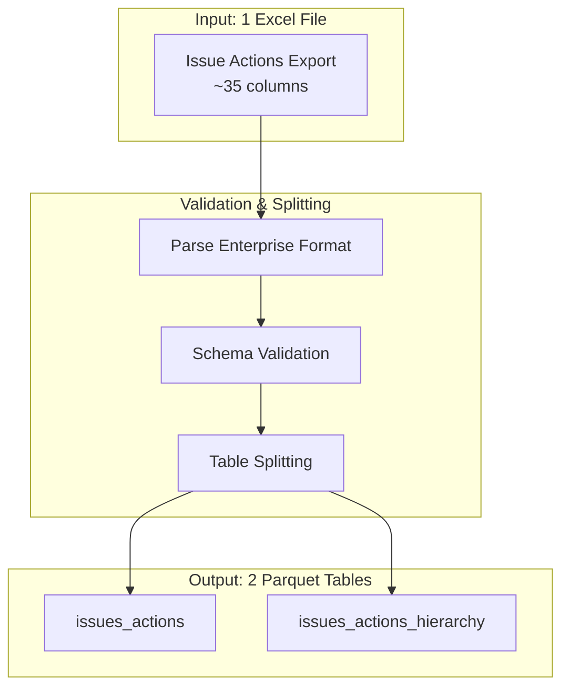
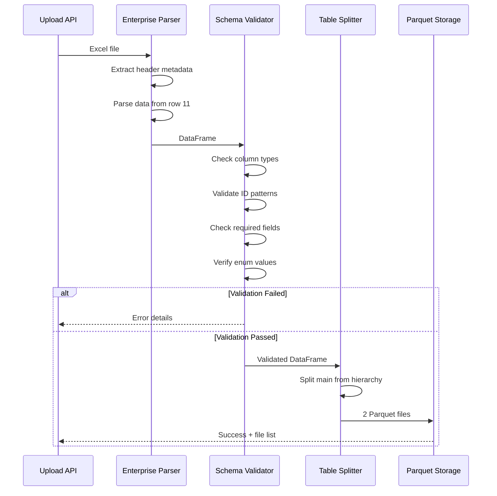
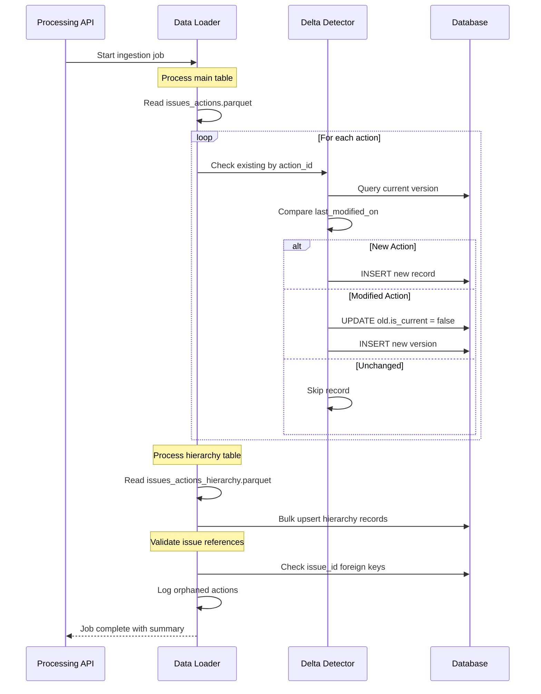
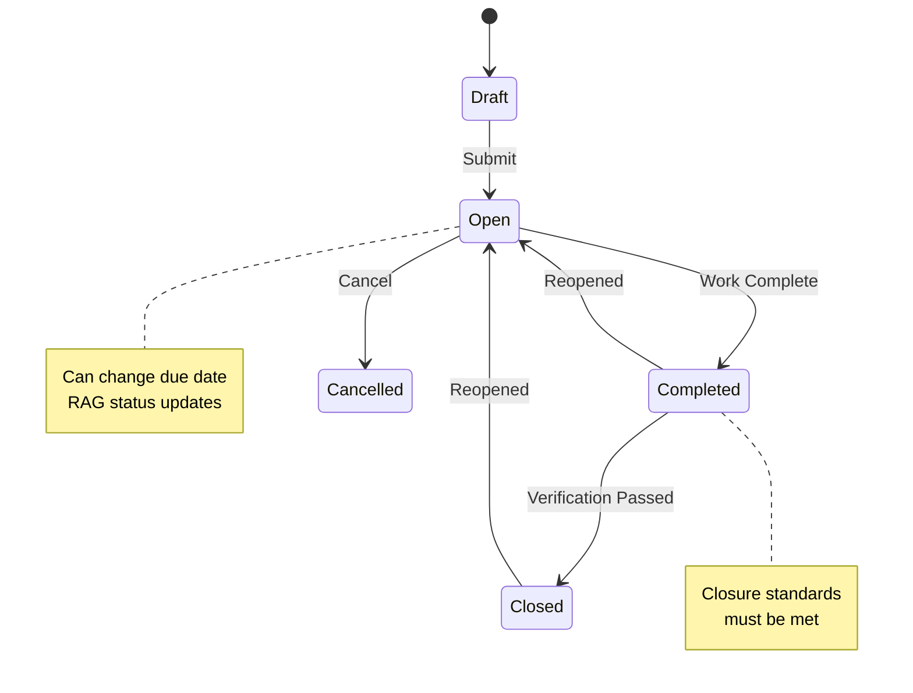
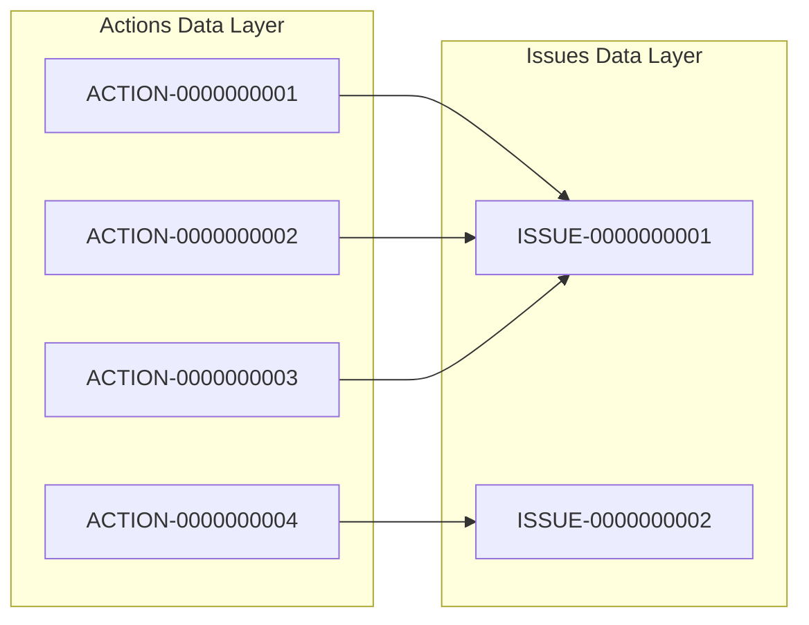
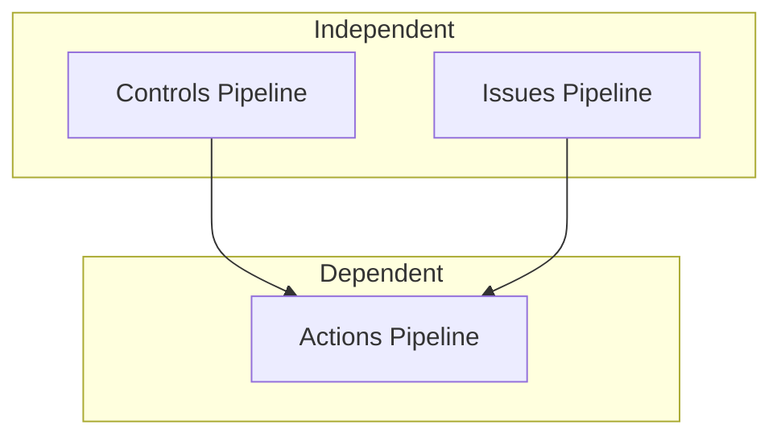

# Actions Pipeline

The Actions pipeline processes issue action plan data. A single Excel file containing all action plans is validated and split into 2 normalized parquet tables for ingestion into the data layer.

## Overview



## File Requirements

| Requirement | Value |
|-------------|-------|
| **File Count** | 1 |
| **Format** | Excel (.xlsx) |
| **Minimum Size** | 5 KB |
| **Maximum Size** | 10 GB |
| **Header Row** | Row 10 (Enterprise format) |
| **Data Start Row** | Row 11 |

:::info Relationship to Issues
Actions are linked to issues via the `issue_id` foreign key. For full functionality, the Issues pipeline should be run first to ensure referential integrity.
:::

---

## Data Model

### Entity Relationship Diagram

```mermaid
erDiagram
    issues_main ||--o{ issues_actions : "1:N"
    issues_actions ||--|| issues_actions_hierarchy : "1:1"

    issues_actions {
        string issue_id FK
        string action_id PK
        string issue_type
        string action_title
        string action_description
        string action_status
        string action_rag_status
        string action_rag_justification
        string status_update_notes
        datetime current_due_date
        datetime original_due_date
        int no_of_due_date_changes
        datetime action_due_date_extension_date
        datetime action_closed_by_action_owner_date
        datetime date_of_reopening_of_action
        string action_owner
        string action_owner_gpn
        string action_administrator
        string action_administrator_gpn
        boolean minimum_standards_for_closure_met
        boolean reopen_action
        boolean reopen_flag
        string program_id
        string ubs_change_program
        datetime date_created
        string originator
        string originator_gpn
        datetime action_status_change_date
        datetime action_rag_last_updated_date
        datetime last_modified_on
    }

    issues_actions_hierarchy {
        string action_id FK
        string group_id
        string group_name
        string division_id
        string division_name
        string unit_id
        string unit_name
        string area_id
        string area_name
        string sector_id
        string sector_name
        string segment_id
        string segment_name
        string function_id
        string function_name
        string l0_location_id
        string l0_location_name
        string region_id
        string region_name
        string sub_region_id
        string sub_region_name
        string country_id
        string country_name
        string company_id
        string company_short_name
    }
```



---

## Table Schemas

### issues_actions

The primary actions table containing action plan information.

**Primary Key:** `action_id`
**Foreign Key:** `issue_id` references `issues_main.issue_id`

#### Primary Keys and References

| Column | Type | Required | Nullable | Description |
|--------|------|----------|----------|-------------|
| `issue_id` | string | Yes | No | Reference to parent issue. Pattern: `ISSUE-XXXXXXXXXX` |
| `action_id` | string | Yes | No | Unique action identifier. Pattern: `ACTION-XXXXXXXXXX` |

#### Core Fields

| Column | Type | Required | Nullable | Description |
|--------|------|----------|----------|-------------|
| `issue_type` | string | Yes | No | Type of parent issue |
| `action_title` | string | Yes | No | Short descriptive title of the action |
| `action_description` | string | Yes | No | Detailed description of the remediation action |

#### Status Fields

| Column | Type | Required | Nullable | Description |
|--------|------|----------|----------|-------------|
| `action_status` | string | Yes | No | Current status of the action |
| `action_rag_status` | string | Yes | No | RAG (Red/Amber/Green) status |
| `action_rag_justification` | string | No | Yes | Justification for RAG status |
| `status_update_notes` | string | No | Yes | Latest status update notes |

**Allowed Values:**

| Column | Allowed Values |
|--------|----------------|
| `issue_type` | `Self-Identified`, `Audit`, `Regulatory`, `Restricted Regulatory` |
| `action_status` | `Draft`, `Open`, `Completed`, `Closed`, `Cancelled` |
| `action_rag_status` | `Red`, `Amber`, `Green` |

#### Date Fields

| Column | Type | Required | Nullable | Description |
|--------|------|----------|----------|-------------|
| `current_due_date` | datetime | Yes | No | Current target completion date |
| `original_due_date` | datetime | Yes | No | Original target completion date |
| `no_of_due_date_changes` | integer | Yes | No | Count of due date changes |
| `action_due_date_extension_date` | datetime | No | Yes | Date of last extension |
| `action_closed_by_action_owner_date` | datetime | No | Yes | Date action was closed by owner |
| `date_of_reopening_of_action` | datetime | No | Yes | Date action was reopened (if applicable) |

#### Ownership Fields

| Column | Type | Required | Nullable | Description |
|--------|------|----------|----------|-------------|
| `action_owner` | string | Yes | No | Name of the action owner |
| `action_owner_gpn` | string | Yes | No | 8-digit Global Personnel Number |
| `action_administrator` | string | Yes | No | Administrator name |
| `action_administrator_gpn` | string | Yes | No | Administrator GPN |

#### Closure and Reopening

| Column | Type | Required | Nullable | Description |
|--------|------|----------|----------|-------------|
| `minimum_standards_for_closure_met` | boolean | Yes | No | Whether closure standards are met |
| `reopen_action` | boolean | Yes | No | Whether action has been reopened |
| `reopen_flag` | boolean | Yes | No | Flag indicating reopen status |

#### Program Information

| Column | Type | Required | Nullable | Description |
|--------|------|----------|----------|-------------|
| `program_id` | string | No | Yes | Associated program identifier |
| `ubs_change_program` | string | No | Yes | UBS change program reference |

#### Audit Trail

| Column | Type | Required | Nullable | Description |
|--------|------|----------|----------|-------------|
| `date_created` | datetime | Yes | No | Action creation timestamp |
| `originator` | string | Yes | No | Name of person who created the action |
| `originator_gpn` | string | Yes | No | Originator GPN |
| `action_status_change_date` | datetime | No | Yes | Last status change timestamp |
| `action_rag_last_updated_date` | datetime | No | Yes | Last RAG update timestamp |
| `last_modified_on` | datetime | Yes | No | Last modification timestamp (used for delta detection) |

---

### issues_actions_hierarchy

Organizational hierarchy information for each action. One-to-one relationship with `issues_actions`.

**Foreign Key:** `action_id` references `issues_actions.action_id`

#### Function Hierarchy

| Column | Type | Required | Description |
|--------|------|----------|-------------|
| `action_id` | string | Yes | Reference to issues_actions |
| `group_id` | string | Yes | Top-level group identifier |
| `group_name` | string | Yes | Group name |
| `division_id` | string | Yes | Division identifier |
| `division_name` | string | Yes | Division name |
| `unit_id` | string | Yes | Business unit identifier |
| `unit_name` | string | Yes | Business unit name |
| `area_id` | string | Yes | Area identifier |
| `area_name` | string | Yes | Area name |
| `sector_id` | string | Yes | Sector identifier |
| `sector_name` | string | Yes | Sector name |
| `segment_id` | string | Yes | Segment identifier |
| `segment_name` | string | Yes | Segment name |
| `function_id` | string | Yes | Function identifier |
| `function_name` | string | Yes | Function name |

#### Location Hierarchy

| Column | Type | Required | Description |
|--------|------|----------|-------------|
| `l0_location_id` | string | Yes | Top-level location identifier |
| `l0_location_name` | string | Yes | Top-level location name |
| `region_id` | string | Yes | Region identifier |
| `region_name` | string | Yes | Region name |
| `sub_region_id` | string | Yes | Sub-region identifier |
| `sub_region_name` | string | Yes | Sub-region name |
| `country_id` | string | Yes | Country identifier |
| `country_name` | string | Yes | Country name |
| `company_id` | string | Yes | Legal entity identifier |
| `company_short_name` | string | Yes | Legal entity short name |

---

## Validation Rules

### Column Pattern Validation

| Column | Pattern | Example Valid | Example Invalid |
|--------|---------|---------------|-----------------|
| `issue_id` | `^ISSUE-\d{10}$` | `ISSUE-0000000001` | `ISSUE-123` |
| `action_id` | `^ACTION-\d{10}$` | `ACTION-0000000001` | `ACTION-123`, `ACT-0000000001` |
| `action_owner_gpn` | `^\d{8}$` | `12345678` | `1234567`, `A2345678` |
| `action_administrator_gpn` | `^\d{8}$` | `87654321` | `876543210` |
| `originator_gpn` | `^\d{8}$` | `11223344` | `1122334` |

### Required Field Validation

The following fields must not be null or empty:

- `issue_id`
- `action_id`
- `issue_type`
- `action_title`
- `action_description`
- `action_status`
- `action_rag_status`
- `current_due_date`
- `original_due_date`
- `action_owner`
- `action_owner_gpn`
- `action_administrator`
- `action_administrator_gpn`
- `date_created`
- `originator`
- `originator_gpn`
- `last_modified_on`

### Referential Integrity

:::warning Foreign Key Validation
During ingestion, the `issue_id` field is validated against existing issues in the data layer. Actions referencing non-existent issues will be flagged but still ingested, with a warning in the job output.
:::

---

## Processing Stages

### Stage 1: Validation



### Stage 2: Ingestion



---

## Database Tables

After ingestion, data is stored in the following data layer tables:

| Parquet File | Database Table | Model |
|--------------|----------------|-------|
| `issues_actions.parquet` | `dl_issue_actions` | `DLIssueAction` |
| `issues_actions_hierarchy.parquet` | `dl_issue_actions_hierarchy` | `DLIssueActionHierarchy` |

### Versioning Fields

All data layer tables include versioning fields:

| Column | Type | Description |
|--------|------|-------------|
| `id` | UUID | Primary key (auto-generated) |
| `is_current` | boolean | Whether this is the active version |
| `valid_from` | datetime | Version validity start |
| `valid_to` | datetime | Version validity end (null if current) |
| `ingestion_id` | string | Reference to upload batch |
| `created_at` | datetime | Record creation timestamp |
| `updated_at` | datetime | Record last update timestamp |

---

## Action Status Lifecycle



---

## Relationship to Issues

Actions are child records of issues, with a many-to-one relationship:



### Aggregation in Issues

The Issues pipeline tracks action counts:

| issues_main Column | Description |
|-------------------|-------------|
| `no_of_open_action_plans` | Count of actions with status `Open` |
| `total_no_of_actions_plans` | Total count of all actions |

---

## Pipeline Dependencies

### Recommended Processing Order

For complete data integrity:

1. **Controls Pipeline** - Independent, can run first
2. **Issues Pipeline** - Independent, can run parallel with Controls
3. **Actions Pipeline** - Should run after Issues for FK validation



### Cross-Pipeline Relationships

| From | To | Relationship |
|------|-----|--------------|
| Actions | Issues | `action.issue_id` → `issue.issue_id` |
| Issues | Controls | `issues_controls.control_id` → `control.control_id` |
| Issues | Issues | `issues_related_issues.related_issue_id` → `issue.issue_id` |

---

## Example Workflow

### 1. Upload Action File

```bash
curl -X POST /api/v2/pipelines/upload \
  -H "X-MS-TOKEN-AAD: <token>" \
  -F "data_type=actions" \
  -F "files=@Issue_Actions_Export.xlsx"
```

### 2. Check Validation Status

```bash
curl /api/v2/pipelines/upload/{batch_id} \
  -H "X-MS-TOKEN-AAD: <token>"
```

**Response:**

```json
{
  "batch_id": "batch-uuid-here",
  "upload_id": "UPL-2026-0003",
  "data_type": "actions",
  "status": "validated",
  "file_count": 1,
  "parquet_files": [
    "issues_actions.parquet",
    "issues_actions_hierarchy.parquet"
  ]
}
```

### 3. Start Ingestion

```bash
curl -X POST /api/v2/processing/ingest \
  -H "X-MS-TOKEN-AAD: <token>" \
  -H "Content-Type: application/json" \
  -d '{"batch_id": "{batch_id}"}'
```

### 4. Monitor Progress

```bash
curl /api/v2/processing/job/{job_id} \
  -H "X-MS-TOKEN-AAD: <token>"
```

**Response (Complete):**

```json
{
  "job_id": "job-uuid-here",
  "batch_id": "batch-uuid-here",
  "job_type": "ingestion",
  "status": "completed",
  "progress": {
    "current_step": "complete",
    "percentage": 100,
    "records_total": 850,
    "records_processed": 850,
    "records_new": 720,
    "records_updated": 130,
    "records_failed": 0
  },
  "warnings": [
    {
      "type": "orphaned_reference",
      "count": 5,
      "message": "5 actions reference non-existent issues"
    }
  ],
  "started_at": "2026-01-28T10:35:01Z",
  "completed_at": "2026-01-28T10:36:15Z",
  "duration_seconds": 74
}
```

---

## Metrics and Reporting

### Action Status Summary

Query to get action status breakdown by issue type:

```sql
SELECT
    issue_type,
    action_status,
    COUNT(*) as count
FROM dl_issue_actions
WHERE is_current = true
GROUP BY issue_type, action_status
ORDER BY issue_type, action_status
```

### Overdue Actions

Query to identify overdue open actions:

```sql
SELECT
    action_id,
    issue_id,
    action_title,
    current_due_date,
    action_owner
FROM dl_issue_actions
WHERE is_current = true
  AND action_status = 'Open'
  AND current_due_date < CURRENT_DATE
ORDER BY current_due_date
```

### RAG Status Distribution

Query for RAG status distribution:

```sql
SELECT
    action_rag_status,
    COUNT(*) as count,
    ROUND(COUNT(*) * 100.0 / SUM(COUNT(*)) OVER (), 2) as percentage
FROM dl_issue_actions
WHERE is_current = true
  AND action_status = 'Open'
GROUP BY action_rag_status
```

---

## Related Documentation

- [Pipeline Overview](/pipelines/overview) - Architecture and API reference
- [Controls Pipeline](/pipelines/controls-pipeline) - Controls data source
- [Issues Pipeline](/pipelines/issues-pipeline) - Issues data source
