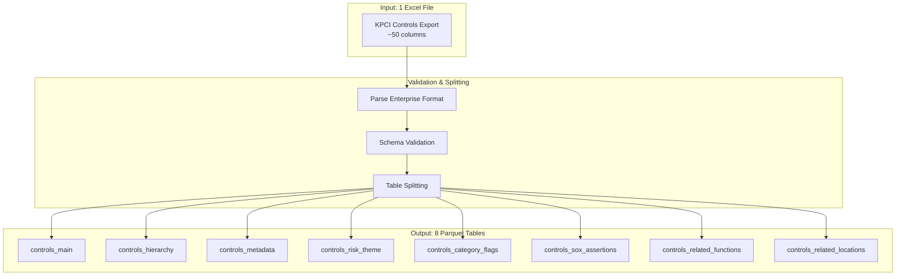
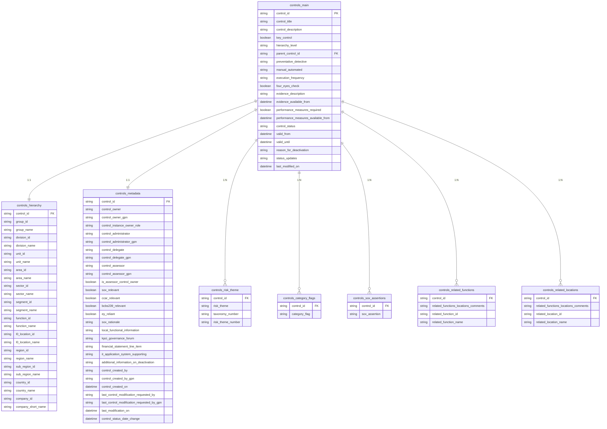
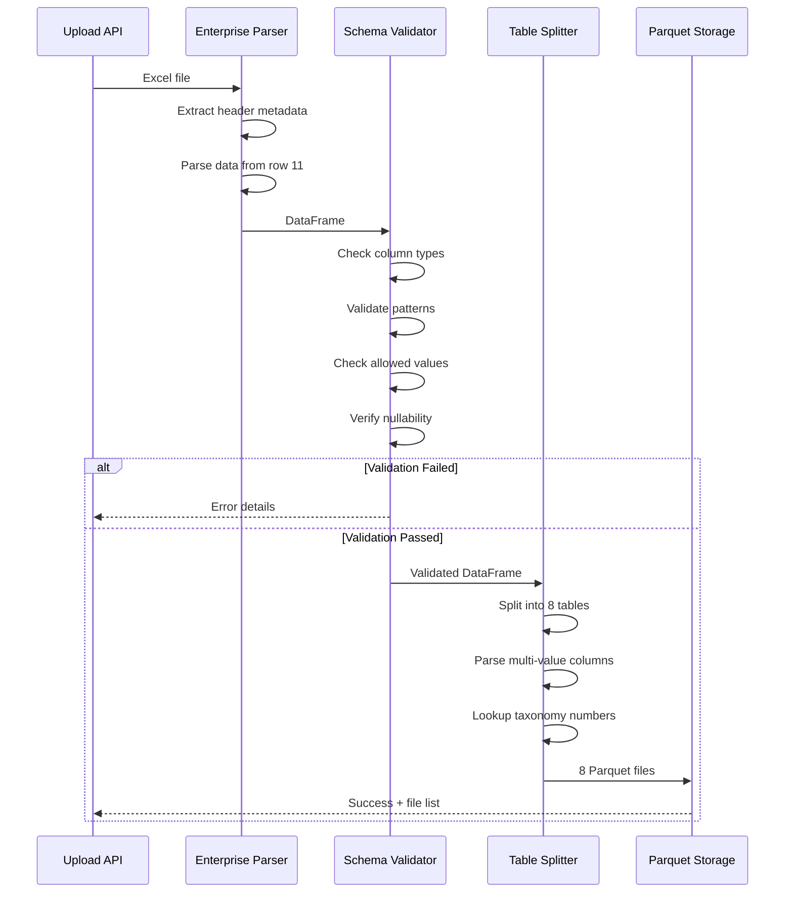
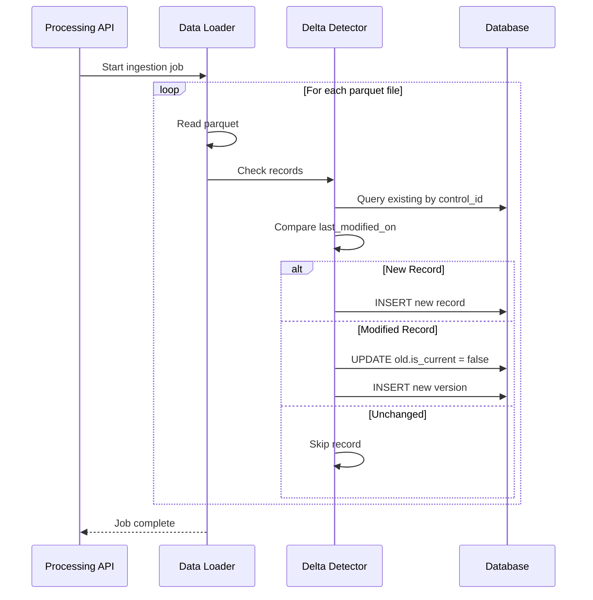

# Controls Pipeline

The Controls pipeline processes Key Performance Controls Inventory (KPCI) data. A single Excel file is validated, split into 8 normalized parquet tables, and loaded into the data layer with full versioning support.

## Overview



## File Requirements

| Requirement | Value |
|-------------|-------|
| **File Count** | 1 |
| **Format** | Excel (.xlsx) |
| **Minimum Size** | 5 KB |
| **Maximum Size** | 10 GB |
| **Header Row** | Row 10 (Enterprise format) |
| **Data Start Row** | Row 11 |

:::info Enterprise Format
The Controls export follows enterprise format where:
- Rows 1-9 contain metadata headers
- Row 10, Column B contains the export timestamp
- Column headers start at Row 10, Column B
- Data begins at Row 11
:::

---

## Data Model

### Entity Relationship Diagram



---

## Table Schemas

### controls_main

The primary controls table containing core control information.

**Primary Key:** `control_id`

| Column | Type | Required | Nullable | Description |
|--------|------|----------|----------|-------------|
| `control_id` | string | Yes | No | Unique control identifier. Pattern: `CTRL-XXXXXXXXXX` (10 digits) |
| `control_title` | string | Yes | No | Short descriptive title of the control |
| `control_description` | string | Yes | No | Detailed description of what the control does |
| `key_control` | boolean | Yes | No | Indicates if this is a key control |
| `hierarchy_level` | string | Yes | No | Control level in hierarchy. Allowed: `Level 1`, `Level 2` |
| `parent_control_id` | string | No | Yes | Reference to parent control (for Level 2 controls) |
| `preventative_detective` | string | Yes | No | Control type classification |
| `manual_automated` | string | Yes | No | Execution method classification |
| `execution_frequency` | string | Yes | No | How often the control is executed |
| `four_eyes_check` | boolean | Yes | No | Whether dual approval is required |
| `evidence_description` | string | Yes | No | Description of evidence collected |
| `evidence_available_from` | datetime | Yes | No | Date from which evidence is available |
| `performance_measures_required` | boolean | Yes | No | Whether KPIs are required |
| `performance_measures_available_from` | datetime | No | Yes | Date from which KPIs are available |
| `control_status` | string | Yes | No | Current status of the control |
| `valid_from` | datetime | Yes | No | Control validity start date |
| `valid_until` | datetime | No | Yes | Control validity end date (if deactivated) |
| `reason_for_deactivation` | string | No | Yes | Reason if control was deactivated |
| `status_updates` | string | No | Yes | Latest status update notes |
| `last_modified_on` | datetime | Yes | No | Last modification timestamp (used for delta detection) |

**Allowed Values:**

| Column | Allowed Values |
|--------|----------------|
| `hierarchy_level` | `Level 1`, `Level 2` |
| `preventative_detective` | `Preventative`, `Detective`, `1st Line Detective`, `2nd Line Detective` |
| `manual_automated` | `Manual`, `Automated`, `IT Dependent Manual` |
| `execution_frequency` | `Daily`, `Weekly`, `Monthly`, `Quarterly`, `Semi-Annually`, `Annually`, `Event Triggered`, `Intraday`, `Others` |
| `control_status` | `Active`, `Inactive` |

---

### controls_hierarchy

Organizational hierarchy information for each control. One-to-one relationship with `controls_main`.

**Foreign Key:** `control_id` references `controls_main.control_id`

#### Function Hierarchy

| Column | Type | Required | Description |
|--------|------|----------|-------------|
| `control_id` | string | Yes | Reference to controls_main |
| `group_id` | string | Yes | Top-level group identifier |
| `group_name` | string | Yes | Group name |
| `division_id` | string | Yes | Division identifier |
| `division_name` | string | Yes | Division name |
| `unit_id` | string | Yes | Business unit identifier |
| `unit_name` | string | Yes | Business unit name |
| `area_id` | string | Yes | Area identifier |
| `area_name` | string | Yes | Area name |
| `sector_id` | string | Yes | Sector identifier |
| `sector_name` | string | Yes | Sector name |
| `segment_id` | string | Yes | Segment identifier |
| `segment_name` | string | Yes | Segment name |
| `function_id` | string | Yes | Function identifier |
| `function_name` | string | Yes | Function name |

#### Location Hierarchy

| Column | Type | Required | Description |
|--------|------|----------|-------------|
| `l0_location_id` | string | Yes | Top-level location identifier |
| `l0_location_name` | string | Yes | Top-level location name |
| `region_id` | string | Yes | Region identifier |
| `region_name` | string | Yes | Region name |
| `sub_region_id` | string | Yes | Sub-region identifier |
| `sub_region_name` | string | Yes | Sub-region name |
| `country_id` | string | Yes | Country identifier |
| `country_name` | string | Yes | Country name |
| `company_id` | string | Yes | Legal entity identifier |
| `company_short_name` | string | Yes | Legal entity short name |

---

### controls_metadata

Ownership, compliance, and audit trail information. One-to-one relationship with `controls_main`.

**Foreign Key:** `control_id` references `controls_main.control_id`

#### Ownership Fields

| Column | Type | Required | Nullable | Description |
|--------|------|----------|----------|-------------|
| `control_id` | string | Yes | No | Reference to controls_main |
| `control_owner` | string | Yes | No | Name of the control owner |
| `control_owner_gpn` | string | Yes | No | 8-digit Global Personnel Number |
| `control_instance_owner_role` | string | Yes | No | Role of the instance owner |
| `control_administrator` | string | Yes | No | Name of the administrator |
| `control_administrator_gpn` | string | Yes | No | Administrator's GPN |
| `control_delegate` | string | No | Yes | Delegate name (if assigned) |
| `control_delegate_gpn` | string | No | Yes | Delegate's GPN |
| `control_assessor` | string | No | Yes | Assessor name (if assigned) |
| `control_assessor_gpn` | string | No | Yes | Assessor's GPN |
| `is_assessor_control_owner` | boolean | Yes | No | Whether assessor is also owner |

#### Compliance Flags

| Column | Type | Required | Description |
|--------|------|----------|-------------|
| `sox_relevant` | boolean | Yes | SOX compliance relevance |
| `ccar_relevant` | boolean | Yes | CCAR compliance relevance |
| `bcbs239_relevant` | boolean | Yes | BCBS239 compliance relevance |
| `ey_reliant` | boolean | Yes | EY reliance flag |
| `sox_rationale` | string | No | Rationale for SOX relevance |

#### Additional Information

| Column | Type | Required | Description |
|--------|------|----------|-------------|
| `local_functional_information` | string | No | Local functional context |
| `kpci_governance_forum` | string | Yes | Governance forum assignment |
| `financial_statement_line_item` | string | No | Related financial statement item |
| `it_application_system_supporting` | string | No | Supporting IT systems |
| `additional_information_on_deactivation` | string | No | Deactivation details |

#### Audit Trail

| Column | Type | Required | Nullable | Description |
|--------|------|----------|----------|-------------|
| `control_created_by` | string | Yes | No | Creator name |
| `control_created_by_gpn` | string | Yes | No | Creator GPN |
| `control_created_on` | datetime | Yes | No | Creation timestamp |
| `last_control_modification_requested_by` | string | No | Yes | Last modifier name |
| `last_control_modification_requested_by_gpn` | string | No | Yes | Last modifier GPN |
| `last_modification_on` | datetime | No | Yes | Last modification timestamp |
| `control_status_date_change` | datetime | No | Yes | Status change timestamp |

---

### controls_risk_theme

Risk theme assignments for each control. One-to-many relationship with `controls_main`.

**Foreign Key:** `control_id` references `controls_main.control_id`

| Column | Type | Required | Description |
|--------|------|----------|-------------|
| `control_id` | string | Yes | Reference to controls_main |
| `risk_theme` | string | Yes | Risk theme name |
| `taxonomy_number` | string | Yes | Top-level NFR taxonomy number (e.g., "1", "2", "3") |
| `risk_theme_number` | string | Yes | Risk theme taxonomy number (e.g., "1.1", "1.2", "3.1") |

:::info Multi-Value Splitting
Risk themes are extracted from a comma-separated column in the source Excel file. Each theme is looked up against the NFR Taxonomy to populate taxonomy numbers.

**Example Source Value:** `"Technology Production Stability, Cyber and Information Security"`

**Generated Records:**
| control_id | risk_theme | taxonomy_number | risk_theme_number |
|------------|-----------|-----------------|-------------------|
| CTRL-0000000001 | Technology Production Stability | 1 | 1.1 |
| CTRL-0000000001 | Cyber and Information Security | 1 | 1.2 |
:::

---

### controls_category_flags

Category flag assignments for each control. One-to-many relationship with `controls_main`.

**Foreign Key:** `control_id` references `controls_main.control_id`

| Column | Type | Required | Description |
|--------|------|----------|-------------|
| `control_id` | string | Yes | Reference to controls_main |
| `category_flag` | string | Yes | Category flag value |

:::info Multi-Value Splitting
Category flags are extracted from a comma-separated column. Each flag becomes a separate row.

**Example Source Value:** `"Critical, High-Risk, Regulatory"`

**Generated Records:**
| control_id | category_flag |
|------------|---------------|
| CTRL-0000000001 | Critical |
| CTRL-0000000001 | High-Risk |
| CTRL-0000000001 | Regulatory |
:::

---

### controls_sox_assertions

SOX assertion mappings for each control. One-to-many relationship with `controls_main`.

**Foreign Key:** `control_id` references `controls_main.control_id`

| Column | Type | Required | Description |
|--------|------|----------|-------------|
| `control_id` | string | Yes | Reference to controls_main |
| `sox_assertion` | string | Yes | SOX assertion type |

**Common SOX Assertions:**
- Existence/Occurrence
- Completeness
- Valuation/Allocation
- Rights and Obligations
- Presentation and Disclosure

---

### controls_related_functions

Related functions for cross-functional controls. One-to-many relationship with `controls_main`.

**Foreign Key:** `control_id` references `controls_main.control_id`

| Column | Type | Required | Nullable | Description |
|--------|------|----------|----------|-------------|
| `control_id` | string | Yes | No | Reference to controls_main |
| `related_functions_locations_comments` | string | No | Yes | Comments about the relationship |
| `related_function_id` | string | Yes | No | Related function identifier |
| `related_function_name` | string | Yes | No | Related function name |

:::info Paired List Splitting
Related functions and locations are stored as paired comma-separated lists in the source Excel:
- `related_function_ids`: "F001, F002, F003"
- `related_function_names`: "Finance, Operations, Risk"

The pipeline pairs these by position index to create individual records.
:::

---

### controls_related_locations

Related locations for multi-location controls. One-to-many relationship with `controls_main`.

**Foreign Key:** `control_id` references `controls_main.control_id`

| Column | Type | Required | Nullable | Description |
|--------|------|----------|----------|-------------|
| `control_id` | string | Yes | No | Reference to controls_main |
| `related_functions_locations_comments` | string | No | Yes | Comments about the relationship |
| `related_location_id` | string | Yes | No | Related location identifier |
| `related_location_name` | string | Yes | No | Related location name |

---

## Validation Rules

### Column Pattern Validation

| Column | Pattern | Example Valid | Example Invalid |
|--------|---------|---------------|-----------------|
| `control_id` | `^CTRL-\d{10}$` | `CTRL-0000000001` | `CTRL-123`, `CTR-0000000001` |
| `control_owner_gpn` | `^\d{8}$` | `12345678` | `1234567`, `A2345678` |
| `control_administrator_gpn` | `^\d{8}$` | `87654321` | `876543210` |

### Required Field Validation

The following fields must not be null or empty:

- `control_id`
- `control_title`
- `control_description`
- `key_control`
- `hierarchy_level`
- `preventative_detective`
- `manual_automated`
- `execution_frequency`
- `control_status`
- `control_owner`
- `control_owner_gpn`
- `last_modified_on`

### Enum Validation

Fields with restricted values are validated against their allowed value lists. Invalid values result in validation errors with the row indices and sample values reported.

---

## Processing Stages

### Stage 1: Validation



### Stage 2: Ingestion



### Stage 3: Model Execution

```mermaid
flowchart LR
    subgraph NFR["NFR Taxonomy"]
        N1[Load control text]
        N2[Classify risk themes]
        N3[Generate reasoning]
        N4[Store output]
    end

    subgraph Enrich["Enrichment"]
        E1[Load control + NFR output]
        E2[Generate summary]
        E3[Calculate complexity]
        E4[Update output]
    end

    subgraph Embed["Embeddings"]
        V1[Load all outputs]
        V2[Generate vector]
        V3[Store embedding]
    end

    N1 --> N2 --> N3 --> N4
    N4 --> E1 --> E2 --> E3 --> E4
    E4 --> V1 --> V2 --> V3
```



---

## Database Tables

After ingestion, data is stored in the following data layer tables:

| Parquet File | Database Table | Model |
|--------------|----------------|-------|
| `controls_main.parquet` | `dl_controls` | `DLControl` |
| `controls_hierarchy.parquet` | `dl_controls_hierarchy` | `DLControlHierarchy` |
| `controls_metadata.parquet` | `dl_controls_metadata` | `DLControlMetadata` |
| `controls_risk_theme.parquet` | `dl_controls_risk_theme` | `DLControlRiskTheme` |
| `controls_category_flags.parquet` | `dl_controls_category_flags` | `DLControlCategoryFlag` |
| `controls_sox_assertions.parquet` | `dl_controls_sox_assertions` | `DLControlSoxAssertion` |
| `controls_related_functions.parquet` | `dl_controls_related_functions` | `DLControlRelatedFunction` |
| `controls_related_locations.parquet` | `dl_controls_related_locations` | `DLControlRelatedLocation` |

### Versioning Fields

All data layer tables include versioning fields:

| Column | Type | Description |
|--------|------|-------------|
| `id` | UUID | Primary key (auto-generated) |
| `is_current` | boolean | Whether this is the active version |
| `valid_from` | datetime | Version validity start |
| `valid_to` | datetime | Version validity end (null if current) |
| `ingestion_id` | string | Reference to upload batch |
| `created_at` | datetime | Record creation timestamp |
| `updated_at` | datetime | Record last update timestamp |

---

## Model Output

After model execution, results are stored in `dl_controls_model_output`:

| Column | Type | Description |
|--------|------|-------------|
| `control_id` | string | Reference to control |
| `nfr_taxonomy_options` | JSON | Array of risk theme classifications |
| `nfr_taxonomy_reasoning` | string | Explanation of classification |
| `summary` | string | AI-generated control summary |
| `complexity_score` | integer | Complexity rating (1-5) |
| `recommended_actions` | string | Suggested improvements |
| `embedding` | vector | 1536-dimension embedding vector |
| `model_version` | string | Version of models used |
| `input_hash` | string | Hash of input for cache detection |
| `processed_at` | datetime | Processing timestamp |

---

## Example Workflow

### 1. Upload Control File

```bash
curl -X POST /api/v2/pipelines/upload \
  -H "X-MS-TOKEN-AAD: <token>" \
  -F "data_type=controls" \
  -F "files=@KPCI_Controls_Export.xlsx"
```

### 2. Check Validation Status

```bash
curl /api/v2/pipelines/upload/{batch_id} \
  -H "X-MS-TOKEN-AAD: <token>"
```

### 3. Start Ingestion

```bash
curl -X POST /api/v2/processing/ingest \
  -H "X-MS-TOKEN-AAD: <token>" \
  -H "Content-Type: application/json" \
  -d '{"batch_id": "{batch_id}"}'
```

### 4. Monitor Progress

```bash
curl /api/v2/processing/job/{job_id} \
  -H "X-MS-TOKEN-AAD: <token>"
```

---

## Related Documentation

- [Pipeline Overview](/pipelines/overview) - Architecture and API reference
- [Issues Pipeline](/pipelines/issues-pipeline) - Issues data source
- [Actions Pipeline](/pipelines/actions-pipeline) - Actions data source
