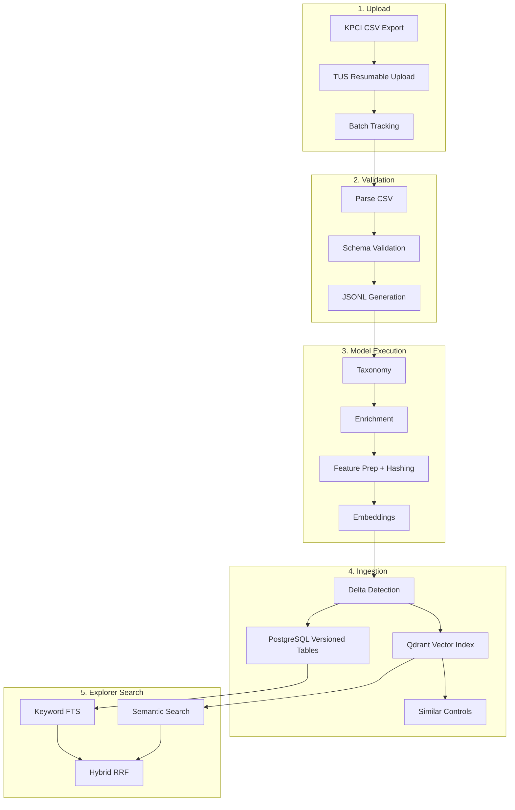
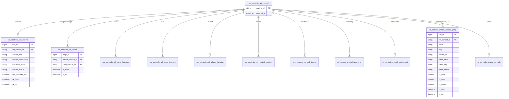
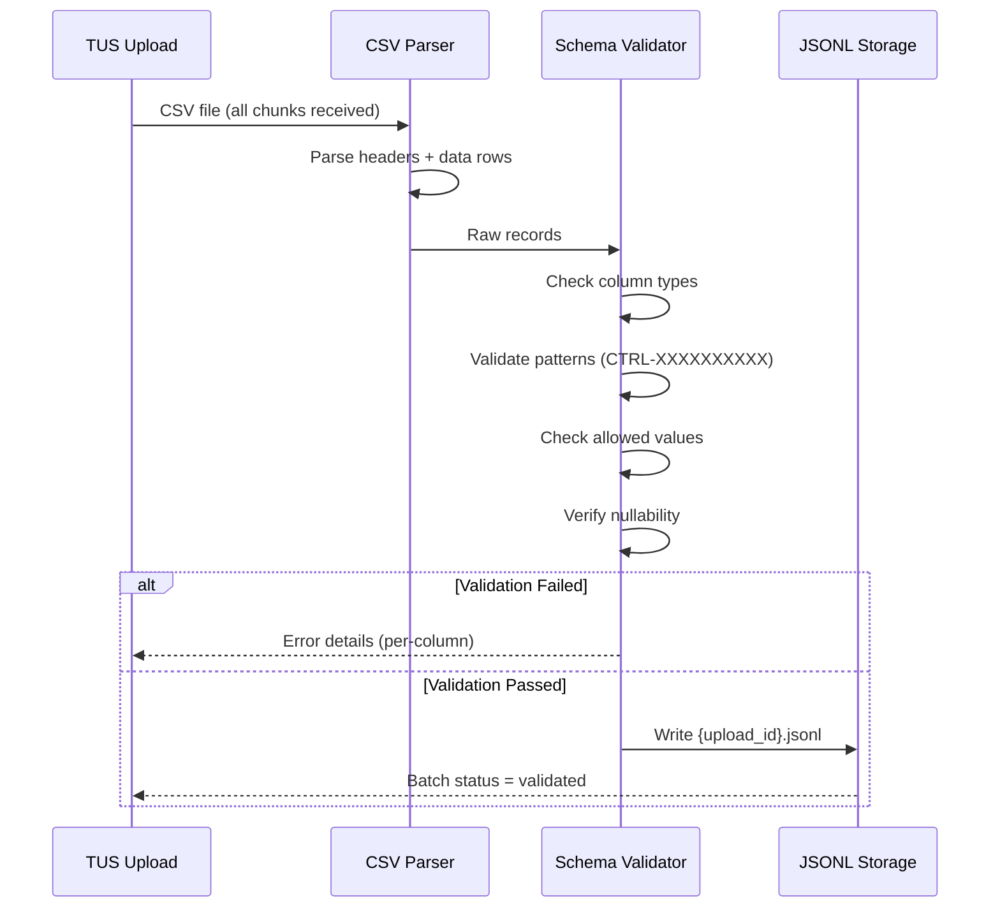
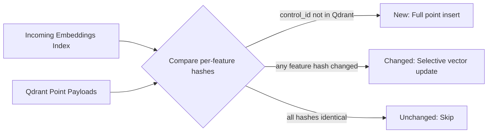
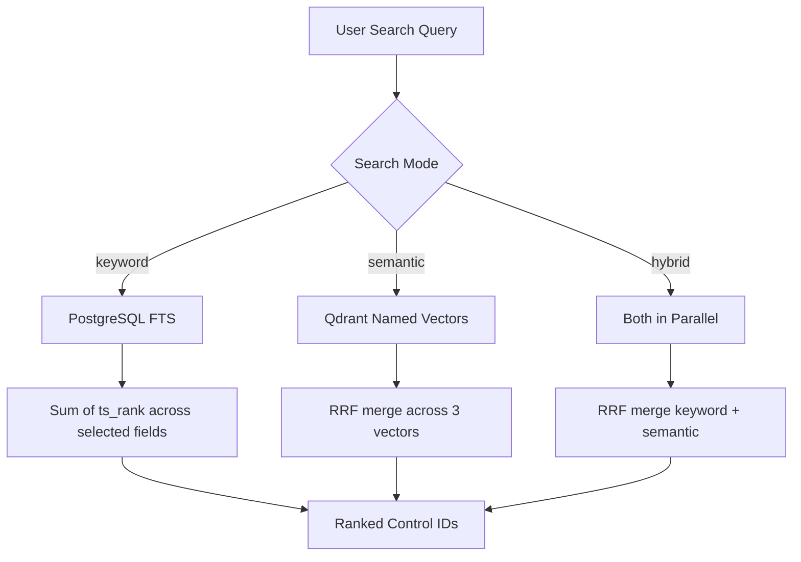
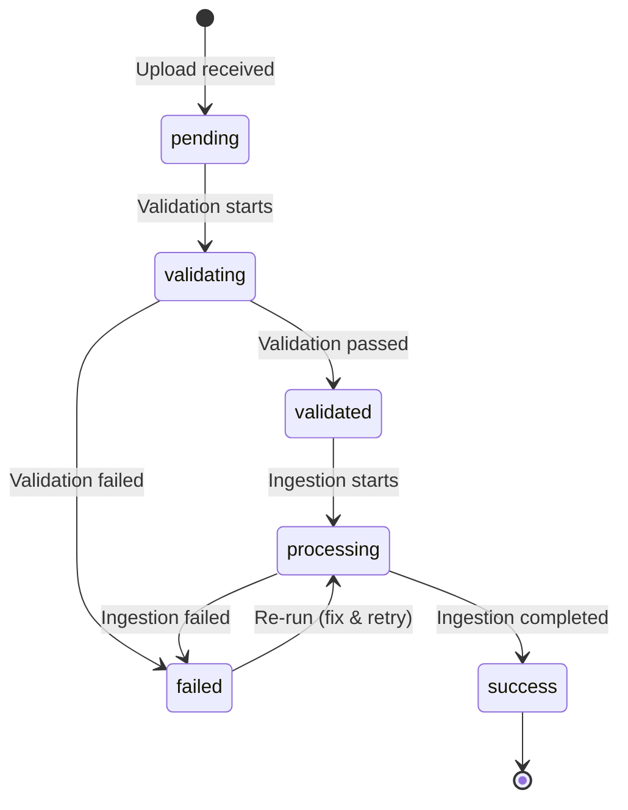

# Controls Pipeline

The Controls pipeline processes Key Performance Controls Inventory (KPCI) data through a multi-stage system: file upload, schema validation, model execution (taxonomy, enrichment, feature prep, embeddings), temporal ingestion into PostgreSQL, vector indexing in Qdrant, and precomputed similar-controls scoring.

## Overview


```mermaid
flowchart TB
    subgraph Upload["1. Upload"]
        CSV[KPCI CSV Export]
        TUS[TUS Resumable Upload]
        BATCH[Batch Tracking]
    end

    subgraph Validation["2. Validation"]
        PARSE[Parse CSV]
        VALIDATE[Schema Validation]
        JSONL[JSONL Generation]
    end

    subgraph Models["3. Model Execution"]
        TAX[Taxonomy]
        ENRICH[Enrichment]
        FPREP[Feature Prep + Hashing]
        EMBED[Embeddings]
    end

    subgraph Ingestion["4. Ingestion"]
        DELTA[Delta Detection]
        PG[PostgreSQL Versioned Tables]
        QDRANT[Qdrant Vector Index]
        SIM[Similar Controls]
    end

    subgraph Explorer["5. Explorer Search"]
        KW[Keyword FTS]
        SEM[Semantic Search]
        HYB[Hybrid RRF]
    end

    CSV --> TUS --> BATCH
    BATCH --> PARSE --> VALIDATE --> JSONL
    JSONL --> TAX --> ENRICH --> FPREP --> EMBED
    EMBED --> DELTA
    DELTA --> PG
    DELTA --> QDRANT
    QDRANT --> SIM
    PG --> KW
    QDRANT --> SEM
    KW --> HYB
    SEM --> HYB
```

## File Requirements

| Requirement | Value |
|---|---|
| **File Count** | 1 |
| **Format** | CSV (.csv) |
| **Minimum Size** | 5 KB |
| **Maximum Size** | 10 GB |
| **Header Row** | Row 1 |
| **Data Start Row** | Row 2 |

---

## Data Model

### L1/L2 Control Hierarchy

Controls follow a two-level hierarchy that is central to the pipeline's indexing and similarity strategy.

| Property | Level 1 | Level 2 |
|---|---|---|
| **Role** | Standard control definition | Localized instance of a Level 1 control |
| **`parent_control_id`** | `NULL` | Points to an L1 control |
| **`control_title`** | Own text | Inherited from parent (~99.9%) |
| **`control_description`** | Own text | Inherited from parent (~99.9%) |
| **`evidence_description`** | Typically empty | Own text (L2-specific) |
| **`local_functional_information`** | Typically empty | Own text (L2-specific) |

:::info Similarity Scope
Because ~99.9% of L2 controls share title/description with their L1 parent, the pipeline restricts **embedding and similarity scoring to L1 Active Key controls only**. L2 controls are indexed for keyword search but do not receive their own similarity results — users are directed to check the L1 parent instead. See [Similar Controls](#similar-controls) below.
:::

### Entity Relationship Diagram


```mermaid
erDiagram
    src_controls_ref_control ||--o{ src_controls_ver_control : "versions"
    src_controls_ref_control ||--o{ src_controls_rel_parent : "parent edge"
    src_controls_ref_control ||--o{ src_controls_rel_owns_function : "owns"
    src_controls_ref_control ||--o{ src_controls_rel_owns_location : "owns"
    src_controls_ref_control ||--o{ src_controls_rel_related_function : "related"
    src_controls_ref_control ||--o{ src_controls_rel_related_location : "related"
    src_controls_ref_control ||--o{ src_controls_rel_risk_theme : "risk theme"
    src_controls_ref_control ||--o{ ai_controls_model_taxonomy : "taxonomy"
    src_controls_ref_control ||--o{ ai_controls_model_enrichment : "enrichment"
    src_controls_ref_control ||--o{ ai_controls_model_feature_prep : "feature prep + FTS"
    src_controls_ref_control ||--o{ ai_controls_similar_controls : "similar"

    src_controls_ref_control {
        string control_id PK
        datetime created_at
    }

    src_controls_ver_control {
        bigint ver_id PK
        string ref_control_id FK
        string control_title
        string control_description
        string hierarchy_level
        string control_status
        datetime last_modified_on
        datetime tx_from
        datetime tx_to
    }

    src_controls_rel_parent {
        bigint edge_id PK
        string parent_control_id FK
        string child_control_id FK
        datetime tx_from
        datetime tx_to
    }

    ai_controls_model_feature_prep {
        bigint ver_id PK
        string ref_control_id FK
        string what
        string why
        string where_col
        string hash_what
        string hash_why
        string hash_where
        tsvector ts_what
        tsvector ts_why
        tsvector ts_where
        datetime tx_from
        datetime tx_to
    }
```

### Temporal Versioning

All tables use transaction-time versioning via `tx_from` / `tx_to` columns instead of boolean `is_current` flags.

| Column | Meaning |
|---|---|
| `tx_from` | Timestamp when this version became active |
| `tx_to` | Timestamp when this version was superseded (`NULL` = current) |

**Current version:** `WHERE tx_to IS NULL`
**Historical version:** `WHERE tx_to IS NOT NULL`

When a control changes, the existing row is closed (`tx_to = now()`) and a new row is inserted (`tx_from = now(), tx_to = NULL`).

---

## Processing Stages

### Stage 1: Validation


```mermaid
sequenceDiagram
    participant Upload as TUS Upload
    participant Parser as CSV Parser
    participant Validator as Schema Validator
    participant Storage as JSONL Storage

    Upload->>Parser: CSV file (all chunks received)
    Parser->>Parser: Parse headers + data rows
    Parser->>Validator: Raw records
    Validator->>Validator: Check column types
    Validator->>Validator: Validate patterns (CTRL-XXXXXXXXXX)
    Validator->>Validator: Check allowed values
    Validator->>Validator: Verify nullability
    alt Validation Failed
        Validator-->>Upload: Error details (per-column)
    else Validation Passed
        Validator->>Storage: Write {upload_id}.jsonl
        Storage-->>Upload: Batch status = validated
    end
```

### Stage 2: Model Execution

Four sequential model stages process the validated controls. Each model reads the source JSONL (and possibly prior model outputs) and writes a separate output file.


```mermaid
flowchart LR
    subgraph Tax["Taxonomy"]
        T1[Load control text]
        T2[Classify NFR risk themes]
        T3[Store taxonomy.jsonl]
    end

    subgraph Enrich["Enrichment"]
        E1[Load control + taxonomy]
        E2[Generate summary + W-criteria]
        E3[Store enrichment.jsonl]
    end

    subgraph FPrep["Feature Prep"]
        C1[Load enrichment output]
        C2[Extract what / why / where]
        C3[Compute per-feature SHA256 hashes]
        C4[Set L1 Active Key masks]
        C5[Store feature_prep.jsonl]
    end

    subgraph Embed["Embeddings"]
        V1[Load feature prep + masks]
        V2[Generate 3 embeddings per control]
        V3[Zero vectors for non-L1 controls]
        V4[Store embeddings.npz + index]
    end

    T1 --> T2 --> T3
    T3 --> E1 --> E2 --> E3
    E3 --> C1 --> C2 --> C3 --> C4 --> C5
    C5 --> V1 --> V2 --> V3 --> V4
```

| Model | Input | Output | Key Fields |
|---|---|---|---|
| **Taxonomy** | Source JSONL | `taxonomy.jsonl` | NFR risk theme classifications, reasoning |
| **Enrichment** | Source + taxonomy | `enrichment.jsonl` | Summary, complexity score, W-criteria yes/no flags, what/why/where details, narratives (roles, process, product, service) |
| **Feature Prep** | Enrichment output + source | `feature_prep.jsonl` | 3 semantic text fields (what, why, where), 3 per-feature hashes, 3 feature masks, keyword FTS pass-through fields |
| **Embeddings** | Feature prep output | `embeddings.npz` + index | 3 named embedding vectors (3072-dim each) |

---

## Three Semantic Features

The pipeline uses 3 LLM-extracted semantic features from enrichment instead of raw source text fields. These capture the essence of a control without boilerplate.

| Feature | Source | Description |
|---|---|---|
| **what** | `what_details` from enrichment | What the control does — its objective and mechanism |
| **why** | `why_details` from enrichment | Why the control exists — the risk or requirement it addresses |
| **where** | `where_details` from enrichment | Where the control operates — organizational/process context |

These 3 features are used for:
- **Embedding vectors** in Qdrant (3 named vectors per point)
- **Similarity scoring** between controls (TF-IDF + cosine)
- **Semantic search** queries

---

## Per-Feature Hashing

The feature prep model computes an independent SHA-256 hash for each of the 3 semantic features, truncated to a 12-character hex prefix with a `CT` marker.

**Hash Format:** `CT-{sha256[:12]}` (e.g., `CT-a3f8b2c1d4e5`)

**Features hashed:**

| Feature | Hash Column | Source |
|---|---|---|
| `what` | `hash_what` | `what_details` from enrichment |
| `why` | `hash_why` | `why_details` from enrichment |
| `where` | `hash_where` | `where_details` from enrichment |

Per-feature hashes are used at two points:
1. **Ingestion delta detection** — compare incoming vs. existing hashes in PostgreSQL to detect changed model outputs
2. **Embedding delta detection** — compare incoming vs. existing hashes in Qdrant to selectively update only changed vectors

---

## Feature Masks

Feature masks are boolean flags that determine whether a feature should be **embedded and indexed** in Qdrant.

**Mask Columns:** `mask_what`, `mask_why`, `mask_where`

### Computation

The feature prep model uses a simple rule: only L1 Active Key controls are eligible for embedding and similarity.

```
mask(feature) =
    L1 Active Key control AND feature text is non-empty → True
    otherwise                                            → False
```

L2 controls get `mask = False` for all features — they are not embedded in Qdrant and do not participate in similarity scoring.

### How Masks Are Used

| Component | How Masks Are Applied |
|---|---|
| **Embeddings** | `mask=False` → zero vector (no embedding generated) |
| **Qdrant Payload** | Masks stored alongside hashes for delta detection |
| **Similar Controls** | Only L1 Active Key controls with `mask=True` participate in scoring |
| **Keyword Search (FTS)** | Masks NOT applied — FTS indexes all text for all controls |
| **Semantic Search** | Implicitly applied — zero vectors produce zero cosine similarity |

:::info Why FTS Ignores Masks
Keyword search intentionally indexes text for all controls including L2. A user searching for "reconciliation" should find both the L1 parent and its L2 children. Semantic search handles this implicitly via zero vectors.
:::

---

## Delta Detection

The ingestion service detects changes at multiple levels to minimize unnecessary writes.

### Source-Level Delta

Compares `last_modified_on` timestamps between incoming and existing records in PostgreSQL. If the timestamp is unchanged, the control is skipped entirely.

### Per-Model Delta

Each AI model output has its own hash (or set of per-feature hashes). The ingestion compares incoming model hashes against existing rows in PostgreSQL and only creates new versions for controls whose model output changed.

### Embedding Delta (Qdrant)

Per-feature hashes from the embeddings index are compared against hashes stored in Qdrant point payloads. This produces three categories:


```mermaid
flowchart LR
    INCOMING[Incoming Embeddings Index] --> COMPARE{Compare per-feature hashes}
    QDRANT[Qdrant Point Payloads] --> COMPARE

    COMPARE -->|control_id not in Qdrant| NEW[New: Full point insert]
    COMPARE -->|any feature hash changed| CHANGED[Changed: Selective vector update]
    COMPARE -->|all hashes identical| SKIP[Unchanged: Skip]
```

| Category | Action | Qdrant Operation |
|---|---|---|
| **New** | Insert point with all 3 named vectors | `upsert` (full point) |
| **Changed** | Update only the vectors whose hash changed | `upsert` (changed vectors + updated payload) |
| **Unchanged** | No Qdrant write | Skip |

---

## Vector Indexing (Qdrant)

Each L1 Active Key control is stored as a single Qdrant point with 3 **named vectors** — one per semantic feature.

### Collection Configuration

| Setting | Value |
|---|---|
| **Collection** | `nfr_connect_controls` |
| **Named Vectors** | 3 (`what`, `why`, `where`) |
| **Embedding Dimension** | 3072 |
| **Distance Metric** | Cosine |
| **Storage** | On-disk |
| **Point ID** | UUID5 derived deterministically from `control_id` |

### Point Payload

Each point carries metadata in its payload for delta detection and downstream consumers:

```json
{
  "control_id": "CTRL-0000012345",
  "hash_what": "CT-a3f8b2c1d4e5",
  "hash_why": "CT-b7e2f4a9c1d3",
  "hash_where": "CT-d1c4a8e3f2b7",
  "mask_what": true,
  "mask_why": true,
  "mask_where": true
}
```

---

## Search Algorithm

The Explorer provides three search modes for controls, using 3 semantic Qdrant vectors and 7 keyword FTS fields.

### Search Fields

| Channel | Fields | Storage |
|---|---|---|
| **Semantic** (Qdrant vectors) | `what`, `why`, `where` | 3 named vectors per point |
| **Keyword** (PostgreSQL FTS) | `control_title`, `control_description`, `what`, `why`, `where`, `evidence_description`, `local_functional_information` | 7 tsvector columns |

### Search Modes


```mermaid
flowchart TB
    QUERY[User Search Query] --> MODE{Search Mode}

    MODE -->|keyword| KW[PostgreSQL FTS]
    MODE -->|semantic| SEM[Qdrant Named Vectors]
    MODE -->|hybrid| HYB[Both in Parallel]

    KW --> RANK_KW[Sum of ts_rank across selected fields]
    SEM --> RANK_SEM[RRF merge across 3 vectors]
    HYB --> MERGE[RRF merge keyword + semantic]

    RANK_KW --> RESULTS[Ranked Control IDs]
    RANK_SEM --> RESULTS
    MERGE --> RESULTS
```

### Keyword Search (PostgreSQL FTS)

Searches `tsvector` columns in `ai_controls_model_feature_prep` using `plainto_tsquery`.

- 7 keyword fields have dedicated `ts_{field}` tsvector columns
- A PostgreSQL trigger auto-generates tsvectors on insert/update
- Partial GIN indexes on `tx_to IS NULL` ensure only current versions are searched
- Ranking: sum of `ts_rank()` across selected fields
- Limit: 2000 results

:::info Inherited Text in FTS
FTS indexes text for **all** controls including L2. An L2 control with an inherited title containing "reconciliation" is findable via keyword search. This is intentional — users expect to find all controls containing a term regardless of hierarchy level.
:::

### Semantic Search (Qdrant Named Vectors)

Embeds the user's query via OpenAI `text-embedding-3-large` (3072-dim), then searches each of the 3 named vectors in parallel.

- Searches each feature vector independently (up to 200 results per feature)
- Results merged via Reciprocal Rank Fusion (RRF) across 3 features
- Only L1 Active Key controls have non-zero vectors; L2 controls naturally produce zero cosine similarity
- Sidebar filter candidates are passed as a Qdrant `FieldCondition` on `control_id`

### Hybrid Search (RRF Merge)

Runs keyword and semantic in parallel, then merges via RRF.

**RRF Formula:**

```
Score(control_id) = Σ 1 / (k + rank_i)
```

Where `k = 60` (standard RRF constant) and `rank_i` is the 0-indexed position in each result list.

Falls back to keyword-only if no OpenAI API key is configured.

### Search Mode Behavior for L1/L2

| Search Mode | L1 Active Key Controls | L2 Controls |
|---|---|---|
| **Keyword** | Found via title, desc, what, why, where | Found via title, desc, evidence, functional_info |
| **Semantic** | Found via what/why/where vectors | Not found (zero vectors) |
| **Hybrid** | Both channels contribute | Keyword channel only |

---

## Similar Controls

Precomputed similar controls use a hybrid TF-IDF + embedding cosine scoring algorithm, restricted to **L1 Active Key controls only**.

### Scope

Only L1 Active Key controls participate in similarity scoring. L2 controls and non-key/inactive controls are excluded. The UI directs users to check the L1 parent for similarity information on L2 controls.

### Scoring Algorithm

For each pair of L1 Active Key controls `(i, j)`, the scorer computes a per-feature score across the 3 semantic features (what, why, where):

```
For each feature f in [what, why, where]:
    embed_cos_f = cosine(embedding_i[f], embedding_j[f])     # [0, 1]
    tfidf_cos_f = cosine(tfidf_i[f], tfidf_j[f])             # [0, 1]
    feature_score_f = (embed_cos_f + tfidf_cos_f) / 2.0

final_score = mean(feature_score_what, feature_score_why, feature_score_where)  # [0, 1]
```

The TF-IDF component uses scikit-learn's `TfidfVectorizer` to weight rare terms higher than common ones, providing better keyword-level discrimination than simple token overlap.

### Categories and Thresholds

Each similar control is labeled with a category based on its score:

| Category | Score Range | Meaning |
|---|---|---|
| **Near Duplicate** | >= 0.90 | Controls that are essentially the same |
| **Weak Similar** | 0.60 - 0.89 | Controls with meaningful similarity |
| *(discarded)* | < 0.60 | Not stored |

Each control retains its **top 3** most similar controls (minimum score 0.60).

**Parent-child exclusion:** Direct parent-child pairs are always excluded from results.

### Full Rebuild vs. Incremental

| Mode | Complexity | When Used |
|---|---|---|
| **Full Rebuild** | O(n²) | Initial load, monthly safety net |
| **Incremental** | O(delta × n) | Daily delta uploads |

**Full rebuild** flow:
1. Load embeddings NPZ (3 features) and normalize
2. Load feature prep JSONL to extract what/why/where text
3. Filter to L1 Active Key controls only
4. Build 3 TF-IDF matrices (one per feature)
5. For each control, find semantic neighbors via Qdrant, compute hybrid scores
6. Keep top-3 per control with score >= 0.60, label categories
7. Write to DB with temporal versioning

**Incremental mode** operates in two phases:
1. **DELETE phase:** Find controls that previously pointed to now-changed controls → rescan and re-rank their neighbors
2. **INSERT phase:** Score new/changed controls against all controls, with reverse kth-score check to update existing top-3 lists that the new control beats

A hub guardrail falls back to full rebuild if the affected set exceeds 20,000 controls (prevents cascading rescans from hub nodes).

Results are stored in `ai_controls_similar_controls` with temporal versioning and a `category` column.

---

## Upload Ordering

Uploads are sequentially numbered within each year (`UPL-YYYY-XXXX`). The pipeline enforces strict ordering: upload N cannot be ingested until upload N-1 has been successfully ingested.


```mermaid
stateDiagram-v2
    [*] --> pending: Upload received
    pending --> validating: Validation starts
    validating --> validated: Validation passed
    validating --> failed: Validation failed
    validated --> processing: Ingestion starts
    failed --> processing: Re-run (fix & retry)
    processing --> success: Ingestion completed
    processing --> failed: Ingestion failed
    success --> [*]
```

**Predecessor check:** Before starting ingestion, the system queries `upload_batches` for the most recent upload of the same `data_type` with an upload_id less than the current one. If that predecessor exists and has any status other than `success`, ingestion is rejected with HTTP 409.

**Edge cases:**
- First upload (`UPL-YYYY-0001` with no predecessor) is always allowed
- Cross-year boundaries are handled naturally by string comparison of zero-padded IDs
- Failed uploads can be re-ingested — the predecessor check looks at the upload before, not itself

---

## Database Tables

### Source Tables

| Table | Description | Key Columns |
|---|---|---|
| `src_controls_ref_control` | Reference table — one row per unique `control_id` | `control_id`, `created_at` |
| `src_controls_ver_control` | Versioned control attributes (temporal) | `ver_id`, `ref_control_id`, `control_title`, `hierarchy_level`, `tx_from`, `tx_to` |

### Relationship Tables

| Table | Description | Key Columns |
|---|---|---|
| `src_controls_rel_parent` | Parent → child edges (L1 → L2) | `parent_control_id`, `child_control_id`, `tx_from`, `tx_to` |
| `src_controls_rel_owns_function` | Control → owning function | `ref_control_id`, `node_id`, `tx_from`, `tx_to` |
| `src_controls_rel_owns_location` | Control → owning location | `ref_control_id`, `node_id`, `tx_from`, `tx_to` |
| `src_controls_rel_related_function` | Control → related functions | `ref_control_id`, `node_id`, `tx_from`, `tx_to` |
| `src_controls_rel_related_location` | Control → related locations | `ref_control_id`, `node_id`, `tx_from`, `tx_to` |
| `src_controls_rel_risk_theme` | Control → risk theme | `ref_control_id`, `theme_id`, `tx_from`, `tx_to` |

### AI Model Output Tables

| Table | Description | Key Columns |
|---|---|---|
| `ai_controls_model_taxonomy` | NFR risk theme classifications | `ref_control_id`, `hash`, `nfr_*` fields, `tx_from`, `tx_to` |
| `ai_controls_model_enrichment` | Summaries, complexity, W-criteria, narratives | `ref_control_id`, `hash`, `summary`, `roles`, `process`, `product`, `service`, `tx_from`, `tx_to` |
| `ai_controls_model_feature_prep` | Semantic features + FTS tsvectors + per-feature hashes | `ref_control_id`, `what`, `why`, `where`, `hash_*`, `ts_*`, `tx_from`, `tx_to` |
| `ai_controls_similar_controls` | Precomputed top-3 similar controls with categories | `ref_control_id`, `similar_control_id`, `score`, `category`, `tx_from`, `tx_to` |

:::warning Embeddings Are Not in PostgreSQL
Embedding vectors are stored exclusively in Qdrant (3 named vectors × 3072 dimensions per control). PostgreSQL only stores the per-feature hashes for delta detection and the tsvectors for keyword search.
:::

### Vector Store (Qdrant)

| Collection | Points | Named Vectors | Dimension | Payload |
|---|---|---|---|---|
| `nfr_connect_controls` | 1 per L1 Active Key control | 3 (`what`, `why`, `where`) | 3072 | `control_id`, 3 hashes, 3 masks |

---

## Storage Structure

```
DATA_INGESTED_PATH/
├── controls/                        # Source JSONL files
│   ├── UPL-2026-0001.jsonl
│   └── UPL-2026-0002.jsonl
│
├── model_runs/                      # Model output files
│   ├── taxonomy/
│   │   ├── UPL-2026-0001.jsonl
│   │   └── UPL-2026-0002.jsonl
│   ├── enrichment/
│   │   └── ...
│   ├── feature_prep/
│   │   └── ...
│   └── embeddings/
│       ├── UPL-2026-0001.npz        # Binary embeddings (3 arrays)
│       ├── UPL-2026-0001.index.jsonl # Per-control hashes + masks
│       └── ...
│
└── .state/
    ├── upload_id_sequence.json
    └── processing_lock.json
```

---

## Example Workflow

### 1. Upload Control File

```bash
# Create TUS upload session
curl -X POST /api/v2/pipelines/tus/ \
  -H "X-MS-TOKEN-AAD: <token>" \
  -H "Upload-Length: 5242880" \
  -H 'Upload-Metadata: data_type Y29udHJvbHM=,filename S1BDSV9Db250cm9scy5jc3Y=,batch_session_id <uuid>,expected_files MQ=='
```

### 2. Check Validation Status

```bash
curl /api/v2/pipelines/upload/{batch_id} \
  -H "X-MS-TOKEN-AAD: <token>"
```

### 3. Start Ingestion

```bash
curl -X POST /api/v2/ingestion/insert \
  -H "X-MS-TOKEN-AAD: <token>" \
  -H "Content-Type: application/json" \
  -d '{"batch_id": 1}'
```

:::warning Upload Ordering
If this is `UPL-2026-0002`, the system verifies that `UPL-2026-0001` was successfully ingested before proceeding. A 409 error is returned if the predecessor has not succeeded.
:::

### 4. Monitor Progress

```bash
curl /api/v2/processing/job/{job_id} \
  -H "X-MS-TOKEN-AAD: <token>"
```

---

## Related Documentation

- [Pipeline Overview](/pipelines/overview) - Architecture and API reference
- [Issues Pipeline](/pipelines/issues-pipeline) - Issues data source schema and processing
- [Actions Pipeline](/pipelines/actions-pipeline) - Actions data source schema and processing
