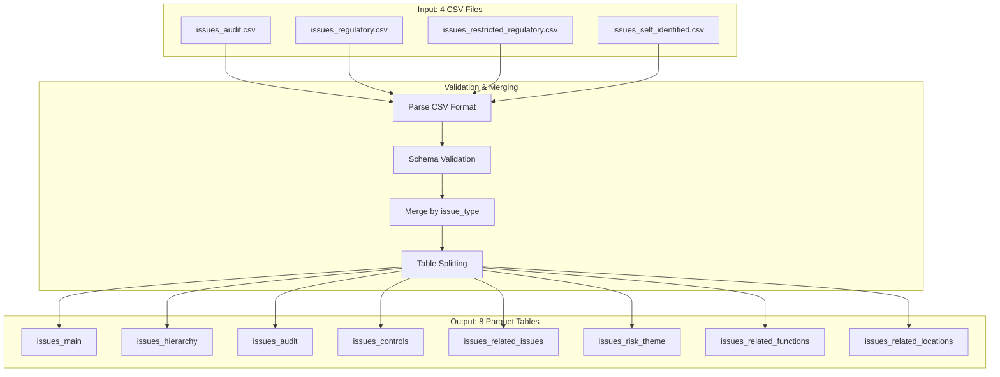
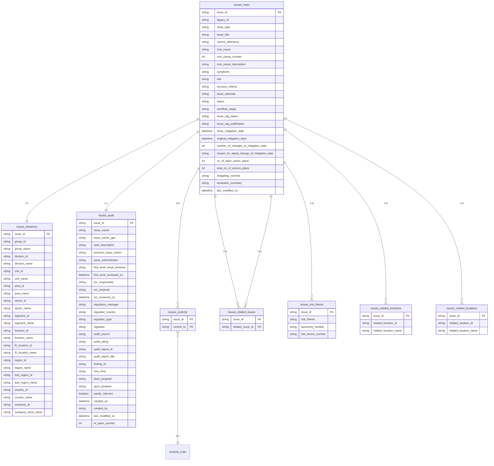
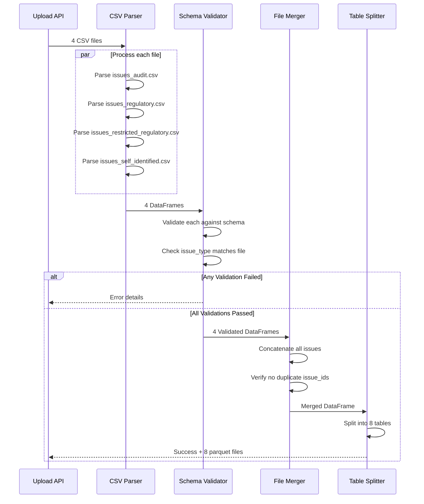
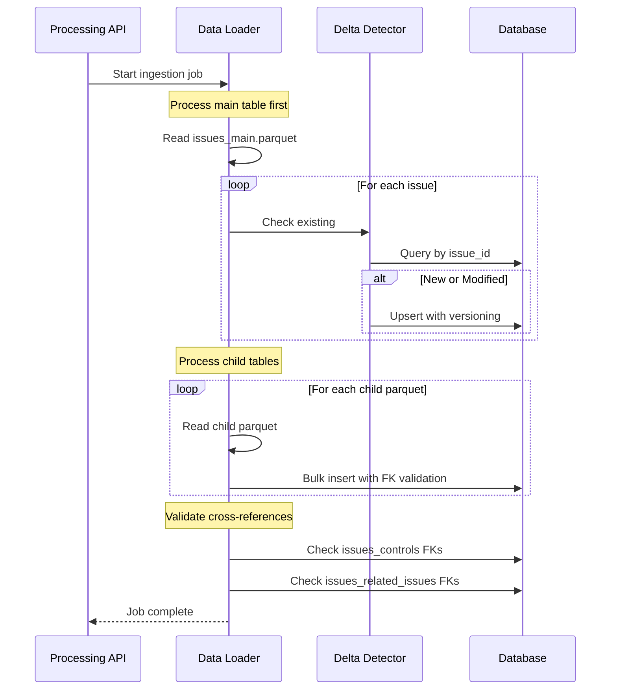
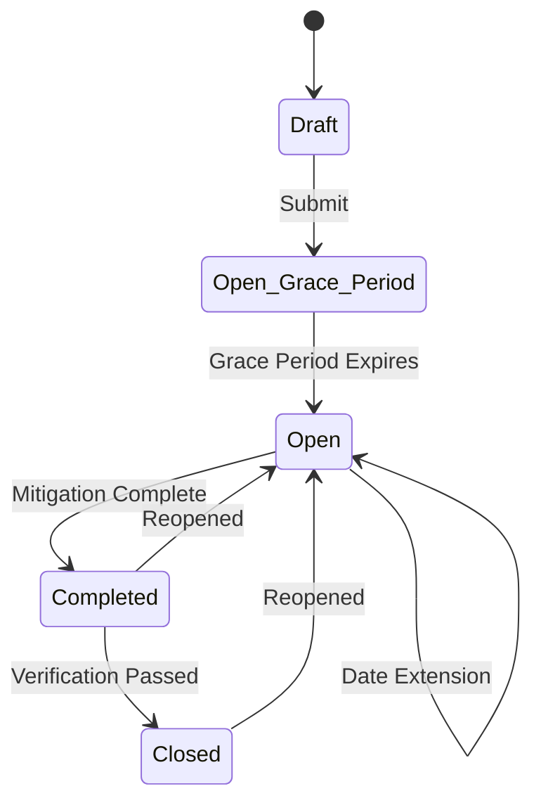

# Issues Pipeline

The Issues pipeline processes issue data from four distinct source files representing different issue types. These are validated, normalized, and merged into 8 parquet tables for ingestion into the data layer.

## Overview



## File Requirements

| Requirement | Value |
|-------------|-------|
| **File Count** | 4 (all required) |
| **Format** | CSV (.csv) |
| **Minimum Size** | 5 KB per file |
| **Maximum Size** | 10 GB total |
| **Header Row** | Row 1 |
| **Data Start Row** | Row 2 |

### Required Files

| File | Issue Type | Description |
|------|------------|-------------|
| `issues_audit.csv` | Audit | Internal and external audit findings |
| `issues_regulatory.csv` | Regulatory | Regulatory examination findings |
| `issues_restricted_regulatory.csv` | Restricted Regulatory | Confidential regulatory matters |
| `issues_self_identified.csv` | Self-Identified | Self-identified control deficiencies |

:::warning All Files Required
All four issue files must be uploaded together in a single batch. The pipeline will fail validation if any file is missing.
:::

---

## Data Model

### Entity Relationship Diagram



---

## Table Schemas

### issues_main

The primary issues table containing core issue information from all four source files.

**Primary Key:** `issue_id`

| Column | Type | Required | Nullable | Description |
|--------|------|----------|----------|-------------|
| `issue_id` | string | Yes | No | Unique issue identifier. Pattern: `ISSUE-XXXXXXXXXX` |
| `legacy_id` | string | No | Yes | Legacy system identifier (if migrated) |
| `issue_type` | string | Yes | No | Issue classification by source |
| `issue_title` | string | Yes | No | Short descriptive title |
| `control_deficiency` | string | Yes | No | Description of the control weakness |
| `root_cause` | string | Yes | No | Root cause category |
| `root_cause_number` | integer | Yes | No | Root cause reference number |
| `root_cause_description` | string | Yes | No | Detailed root cause explanation |
| `symptoms` | string | Yes | No | Observable symptoms of the issue |
| `risk` | string | Yes | No | Risk description and impact |
| `success_criteria` | string | Yes | No | Criteria for issue closure |
| `issue_rationale` | string | No | Yes | Additional rationale or context |
| `status` | string | Yes | No | Current issue status |
| `workflow_stage` | string | Yes | No | Current workflow stage |
| `issue_rag_status` | string | Yes | No | RAG (Red/Amber/Green) status |
| `issue_rag_justification` | string | No | Yes | Justification for RAG status |
| `issue_mitigation_date` | datetime | Yes | No | Current target mitigation date |
| `original_mitigation_date` | datetime | Yes | No | Original mitigation date |
| `number_of_changes_to_mitigation_date` | integer | Yes | No | Count of date changes |
| `reason_for_latest_change_of_mitigation_date` | string | No | Yes | Reason for last date change |
| `no_of_open_action_plans` | integer | Yes | No | Count of open action plans |
| `total_no_of_actions_plans` | integer | Yes | No | Total action plan count |
| `mitigating_controls` | string | No | Yes | Interim mitigating controls |
| `resolution_summary` | string | No | Yes | Summary of resolution (when closed) |
| `last_modified_on` | datetime | Yes | No | Last modification timestamp |

**Allowed Values:**

| Column | Allowed Values |
|--------|----------------|
| `issue_type` | `Self-Identified`, `Audit`, `Regulatory`, `Restricted Regulatory` |
| `status` | `Draft`, `Open - Grace Period`, `Open`, `Completed`, `Closed` |
| `issue_rag_status` | `Red`, `Amber`, `Green` |

---

### issues_hierarchy

Organizational hierarchy information for each issue. One-to-one relationship with `issues_main`.

**Foreign Key:** `issue_id` references `issues_main.issue_id`

#### Function Hierarchy

| Column | Type | Required | Description |
|--------|------|----------|-------------|
| `issue_id` | string | Yes | Reference to issues_main |
| `group_id` | string | Yes | Top-level group identifier |
| `group_name` | string | Yes | Group name |
| `division_id` | string | Yes | Division identifier |
| `division_name` | string | Yes | Division name |
| `unit_id` | string | Yes | Business unit identifier |
| `unit_name` | string | Yes | Business unit name |
| `area_id` | string | Yes | Area identifier |
| `area_name` | string | Yes | Area name |
| `sector_id` | string | Yes | Sector identifier |
| `sector_name` | string | Yes | Sector name |
| `segment_id` | string | Yes | Segment identifier |
| `segment_name` | string | Yes | Segment name |
| `function_id` | string | Yes | Function identifier |
| `function_name` | string | Yes | Function name |

#### Location Hierarchy

| Column | Type | Required | Description |
|--------|------|----------|-------------|
| `l0_location_id` | string | Yes | Top-level location identifier |
| `l0_location_name` | string | Yes | Top-level location name |
| `region_id` | string | Yes | Region identifier |
| `region_name` | string | Yes | Region name |
| `sub_region_id` | string | Yes | Sub-region identifier |
| `sub_region_name` | string | Yes | Sub-region name |
| `country_id` | string | Yes | Country identifier |
| `country_name` | string | Yes | Country name |
| `company_id` | string | Yes | Legal entity identifier |
| `company_short_name` | string | Yes | Legal entity short name |

---

### issues_audit

Ownership, review chain, regulatory information, and audit trail. One-to-one relationship with `issues_main`.

**Foreign Key:** `issue_id` references `issues_main.issue_id`

#### Ownership Fields

| Column | Type | Required | Nullable | Description |
|--------|------|----------|----------|-------------|
| `issue_id` | string | Yes | No | Reference to issues_main |
| `issue_owner` | string | Yes | No | Name of the issue owner |
| `issue_owner_gpn` | string | Yes | No | 8-digit Global Personnel Number |
| `rank_description` | string | No | Yes | Owner's rank/title |
| `previous_issue_owner` | string | No | Yes | Previous owner name |
| `previous_issue_owner_gpn` | string | No | Yes | Previous owner GPN |
| `issue_administrator` | string | Yes | No | Administrator name |
| `issue_administrator_gpn` | string | Yes | No | Administrator GPN |
| `issue_administrator_delegate` | string | No | Yes | Delegate name |
| `issue_administrator_delegate_gpn` | string | No | Yes | Delegate GPN |

#### Review Chain

| Column | Type | Required | Nullable | Description |
|--------|------|----------|----------|-------------|
| `first_level_issue_reviewer` | string | No | Yes | First level reviewer name |
| `first_level_issue_reviewer_gpn` | string | No | Yes | First level reviewer GPN |
| `first_level_reviewed_on` | datetime | No | Yes | First level review date |
| `orc_responsible` | string | No | Yes | ORC responsible party |
| `orc_reviewer` | string | No | Yes | ORC reviewer name |
| `orc_reviewer_gpn` | string | No | Yes | ORC reviewer GPN |
| `orc_reviewed_on` | datetime | No | Yes | ORC review date |

#### ORC Review Details

| Column | Type | Nullable | Description |
|--------|------|----------|-------------|
| `issue_articulation_and_ownership_check` | string | Yes | Check result |
| `issue_articulation_and_ownership_review` | string | Yes | Review status |
| `issue_articulation_and_ownership_comment` | string | Yes | Reviewer comments |
| `issue_rating_check` | string | Yes | Rating check result |
| `issue_rating_review` | string | Yes | Rating review status |
| `issue_rating_comment` | string | Yes | Rating comments |
| `issue_mitigation_date_check` | string | Yes | Date check result |
| `issue_mitigation_date_review` | string | Yes | Date review status |
| `issue_mitigation_date_comment` | string | Yes | Date comments |
| `action_plans_check` | string | Yes | Action plans check result |
| `action_plans_review` | string | Yes | Action plans review status |
| `action_plans_comment` | string | Yes | Action plans comments |
| `mappings_check` | string | Yes | Mappings check result |
| `mappings_review` | string | Yes | Mappings review status |
| `mappings_comment` | string | Yes | Mappings comments |

#### Regulatory Information

| Column | Type | Nullable | Description |
|--------|------|----------|-------------|
| `regulatory_manager` | string | Yes | Regulatory manager name |
| `regulatory_manager_gpn` | string | Yes | Regulatory manager GPN |
| `regulator_country` | string | Yes | Regulator's country |
| `regulator_type` | string | Yes | Type of regulator |
| `regulator` | string | Yes | Regulator name |

#### Audit-Specific Fields

| Column | Type | Nullable | Description |
|--------|------|----------|-------------|
| `audit_source` | string | Yes | Source of audit finding |
| `audit_rating` | string | Yes | Audit rating assigned |
| `audit_report_id` | string | Yes | Audit report identifier |
| `audit_report_title` | string | Yes | Audit report title |
| `finding_id` | string | Yes | Specific finding identifier |
| `mra_mria` | string | Yes | MRA/MRIA classification |

#### Program Information

| Column | Type | Nullable | Description |
|--------|------|----------|-------------|
| `dsori_program` | string | Yes | DSORI program reference |
| `gsori_program` | string | Yes | GSORI program reference |
| `eandy_relevant` | boolean | No | E&Y relevance flag |
| `operating_committee` | string | Yes | Operating committee |
| `sub_operating_committee` | string | Yes | Sub-operating committee |
| `lead_region_oversight_body` | string | Yes | Lead region oversight body |

#### Risk Acceptance

| Column | Type | Nullable | Description |
|--------|------|----------|-------------|
| `reprioritization_risk_acceptance_justification` | string | Yes | Justification for risk acceptance |
| `extend_reprioritization_risk_acceptance` | boolean | No | Extension requested |
| `reprioritization_risk_acceptance_extension_date` | datetime | Yes | Extension target date |
| `reprioritization_risk_acceptance_extension_comment` | string | Yes | Extension comment |
| `reprioritization_risk_acceptance_extension_approve` | boolean | No | Extension approved |
| `reprioritization_risk_acceptance_extension_approval` | string | Yes | Approver information |

#### Category Information

| Column | Type | Nullable | Description |
|--------|------|----------|-------------|
| `category_flag` | string | Yes | Category flag |
| `category_type` | string | Yes | Category type |

#### Audit Trail Timestamps

| Column | Type | Required | Nullable | Description |
|--------|------|----------|----------|-------------|
| `created_on` | datetime | Yes | No | Issue creation timestamp |
| `created_by` | string | Yes | No | Creator name |
| `created_by_gpn` | string | Yes | No | Creator GPN |
| `raised_by` | string | No | Yes | Person who raised the issue |
| `raised_by_gpn` | string | No | Yes | Raiser GPN |
| `last_modified_by` | string | No | Yes | Last modifier name |
| `last_modified_by_gpn` | string | No | Yes | Last modifier GPN |
| `last_modified_on` | datetime | No | Yes | Last modification timestamp |
| `status_change_timestamp` | datetime | No | Yes | Last status change |
| `draft_status_timestamp` | datetime | No | Yes | When entered draft status |
| `open_grace_period_status_timestamp` | datetime | No | Yes | When entered grace period |
| `open_status_timestamp` | datetime | No | Yes | When entered open status |
| `issue_rag_last_updated_date` | datetime | No | Yes | Last RAG update |
| `issue_mitigation_date_change` | datetime | No | Yes | Last mitigation date change |

#### Comments

| Column | Type | Nullable | Description |
|--------|------|----------|-------------|
| `comment` | string | Yes | Latest comment text |
| `comment_timestamp` | datetime | Yes | Comment timestamp |
| `last_comment_by` | string | Yes | Commenter name |
| `last_comment_by_gpn` | string | Yes | Commenter GPN |

#### Counters

| Column | Type | Required | Description |
|--------|------|----------|-------------|
| `re_open_counter` | integer | Yes | Number of times reopened |

---

### issues_controls

Junction table linking issues to related controls. One-to-many relationship with `issues_main`.

**Foreign Keys:**
- `issue_id` references `issues_main.issue_id`
- `control_id` references `controls_main.control_id`

| Column | Type | Required | Description |
|--------|------|----------|-------------|
| `issue_id` | string | Yes | Reference to issues_main |
| `control_id` | string | Yes | Reference to controls_main |

:::info Cross-Reference
This table enables linking issues to the controls that they impact. When both issues and controls datasets are ingested, this relationship allows navigation from issues to affected controls and vice versa.
:::

---

### issues_related_issues

Self-referential junction table for related issues. One-to-many relationship with `issues_main`.

**Foreign Keys:**
- `issue_id` references `issues_main.issue_id`
- `related_issue_id` references `issues_main.issue_id`

| Column | Type | Required | Description |
|--------|------|----------|-------------|
| `issue_id` | string | Yes | Source issue reference |
| `related_issue_id` | string | Yes | Related issue reference |

:::info Self-Referential Relationship
This table captures relationships between issues, such as parent-child relationships or duplicate tracking. The `related_issue_id` must reference a valid issue in the same dataset.
:::

---

### issues_risk_theme

Risk theme assignments for each issue. One-to-many relationship with `issues_main`.

**Foreign Key:** `issue_id` references `issues_main.issue_id`

| Column | Type | Required | Description |
|--------|------|----------|-------------|
| `issue_id` | string | Yes | Reference to issues_main |
| `risk_theme` | string | Yes | Risk theme name |
| `taxonomy_number` | string | Yes | Top-level NFR taxonomy number |
| `risk_theme_number` | string | Yes | Risk theme taxonomy number |

:::info Multi-Value Splitting
Risk themes are extracted from a comma-separated column and looked up against the NFR Taxonomy.

**Example Source Value:** `"Financial Crime Prevention, Conduct Risk"`

**Generated Records:**
| issue_id | risk_theme | taxonomy_number | risk_theme_number |
|----------|-----------|-----------------|-------------------|
| ISSUE-0000000001 | Financial Crime Prevention | 3 | 3.1 |
| ISSUE-0000000001 | Conduct Risk | 4 | 4.1 |
:::

---

### issues_related_functions

Related functions for cross-functional issues. One-to-many relationship with `issues_main`.

**Foreign Key:** `issue_id` references `issues_main.issue_id`

| Column | Type | Required | Description |
|--------|------|----------|-------------|
| `issue_id` | string | Yes | Reference to issues_main |
| `related_function_id` | string | Yes | Related function identifier |
| `related_function_name` | string | Yes | Related function name |

---

### issues_related_locations

Related locations for multi-location issues. One-to-many relationship with `issues_main`.

**Foreign Key:** `issue_id` references `issues_main.issue_id`

| Column | Type | Required | Description |
|--------|------|----------|-------------|
| `issue_id` | string | Yes | Reference to issues_main |
| `related_location_id` | string | Yes | Related location identifier |
| `related_location_name` | string | Yes | Related location name |

---

## Validation Rules

### Column Pattern Validation

| Column | Pattern | Example Valid | Example Invalid |
|--------|---------|---------------|-----------------|
| `issue_id` | `^ISSUE-\d{10}$` | `ISSUE-0000000001` | `ISSUE-123`, `ISS-0000000001` |
| `issue_owner_gpn` | `^\d{8}$` | `12345678` | `1234567`, `A2345678` |
| `issue_administrator_gpn` | `^\d{8}$` | `87654321` | `876543210` |

### Required Field Validation

The following fields must not be null or empty:

- `issue_id`
- `issue_type`
- `issue_title`
- `control_deficiency`
- `root_cause`
- `status`
- `issue_rag_status`
- `issue_mitigation_date`
- `issue_owner`
- `issue_owner_gpn`
- `last_modified_on`

### File-Specific Validation

Each source file must contain only issues matching its expected type:

| File | Expected `issue_type` |
|------|----------------------|
| `issues_audit.csv` | `Audit` |
| `issues_regulatory.csv` | `Regulatory` |
| `issues_restricted_regulatory.csv` | `Restricted Regulatory` |
| `issues_self_identified.csv` | `Self-Identified` |

---

## Processing Stages

### Stage 1: Multi-File Validation



### Stage 2: Ingestion with Cross-References



### Stage 3: Model Execution

```mermaid
flowchart LR
    subgraph NFR["NFR Taxonomy"]
        N1[Load issue text]
        N2[Classify risk themes]
        N3[Generate reasoning]
        N4[Store output]
    end

    subgraph Enrich["Enrichment"]
        E1[Load issue + NFR output]
        E2[Generate summary]
        E3[Assess severity]
        E4[Update output]
    end

    subgraph Embed["Embeddings"]
        V1[Load all outputs]
        V2[Generate vector]
        V3[Store embedding]
    end

    N1 --> N2 --> N3 --> N4
    N4 --> E1 --> E2 --> E3 --> E4
    E4 --> V1 --> V2 --> V3
```



---

## Database Tables

After ingestion, data is stored in the following data layer tables:

| Parquet File | Database Table | Model |
|--------------|----------------|-------|
| `issues_main.parquet` | `dl_issues` | `DLIssue` |
| `issues_hierarchy.parquet` | `dl_issues_hierarchy` | `DLIssueHierarchy` |
| `issues_audit.parquet` | `dl_issues_audit` | `DLIssueAudit` |
| `issues_controls.parquet` | `dl_issues_controls` | `DLIssueControl` |
| `issues_related_issues.parquet` | `dl_issues_related_issues` | `DLIssueRelatedIssue` |
| `issues_risk_theme.parquet` | `dl_issues_risk_theme` | `DLIssueRiskTheme` |
| `issues_related_functions.parquet` | `dl_issues_related_functions` | `DLIssueRelatedFunction` |
| `issues_related_locations.parquet` | `dl_issues_related_locations` | `DLIssueRelatedLocation` |

### Versioning Fields

All data layer tables include versioning fields:

| Column | Type | Description |
|--------|------|-------------|
| `id` | UUID | Primary key (auto-generated) |
| `is_current` | boolean | Whether this is the active version |
| `valid_from` | datetime | Version validity start |
| `valid_to` | datetime | Version validity end (null if current) |
| `ingestion_id` | string | Reference to upload batch |
| `created_at` | datetime | Record creation timestamp |
| `updated_at` | datetime | Record last update timestamp |

---

## Model Output

After model execution, results are stored in `dl_issues_model_output`:

| Column | Type | Description |
|--------|------|-------------|
| `issue_id` | string | Reference to issue |
| `nfr_taxonomy_options` | JSON | Array of risk theme classifications |
| `nfr_taxonomy_reasoning` | string | Explanation of classification |
| `summary` | string | AI-generated issue summary |
| `severity_assessment` | string | Severity analysis |
| `recommended_actions` | string | Suggested remediation steps |
| `embedding` | vector | 1536-dimension embedding vector |
| `model_version` | string | Version of models used |
| `input_hash` | string | Hash of input for cache detection |
| `processed_at` | datetime | Processing timestamp |

---

## Issue Status Lifecycle



---

## Example Workflow

### 1. Upload Issue Files

```bash
curl -X POST /api/v2/pipelines/upload \
  -H "X-MS-TOKEN-AAD: <token>" \
  -F "data_type=issues" \
  -F "files=@issues_audit.csv" \
  -F "files=@issues_regulatory.csv" \
  -F "files=@issues_restricted_regulatory.csv" \
  -F "files=@issues_self_identified.csv"
```

### 2. Check Validation Status

```bash
curl /api/v2/pipelines/upload/{batch_id} \
  -H "X-MS-TOKEN-AAD: <token>"
```

### 3. Start Ingestion

```bash
curl -X POST /api/v2/processing/ingest \
  -H "X-MS-TOKEN-AAD: <token>" \
  -H "Content-Type: application/json" \
  -d '{"batch_id": "{batch_id}"}'
```

### 4. Monitor Progress

```bash
curl /api/v2/processing/job/{job_id} \
  -H "X-MS-TOKEN-AAD: <token>"
```

---

## Related Documentation

- [Pipeline Overview](/pipelines/overview) - Architecture and API reference
- [Controls Pipeline](/pipelines/controls-pipeline) - Controls data source
- [Actions Pipeline](/pipelines/actions-pipeline) - Actions data source
