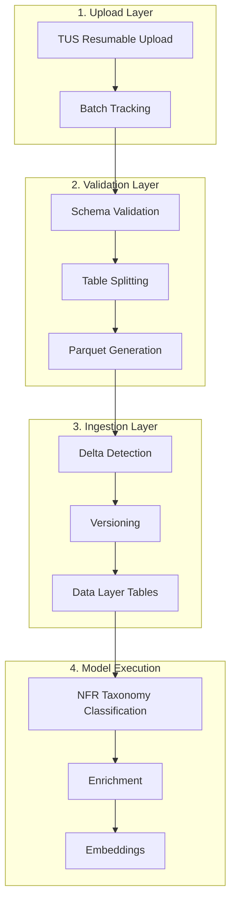
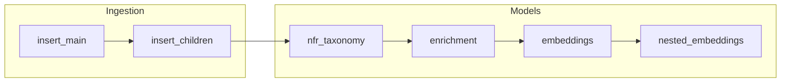

# Pipeline Overview

The NFR Connect Pipeline is a comprehensive data ingestion and processing system designed for enterprise-scale non-financial risk data. It provides resumable uploads, schema validation, delta-based ingestion, and ML-powered enrichment.

## Architecture Overview



## Supported Data Sources

| Data Source | Files Required | Description |
|-------------|----------------|-------------|
| **Controls** | 1 CSV file | Key Performance Controls Inventory (KPCI) data |
| **Issues** | 4 CSV files | Audit, Regulatory, Restricted Regulatory, Self-Identified issues |
| **Actions** | 1 CSV file | Issue action plans and remediation tracking |

## Pipeline Stages

### Stage 1: File Upload

Files are uploaded using the **TUS (resumable upload) protocol**, ensuring reliability for large files and unstable network connections.

**Key Features:**
- Chunk-based uploads (5MB chunks)
- Automatic resume on connection failure
- File size validation (minimum 5KB)
- Extension validation (.csv only)
- Batch session grouping for multi-file uploads

### Stage 2: Validation

Uploaded files undergo comprehensive validation:

1. **Format Parsing** - Column headers and data parsing
2. **Schema Validation** - Column types, patterns, required fields, allowed values
3. **Table Splitting** - Single CSV file split into multiple normalized parquet tables
4. **Multi-Value Parsing** - Comma-separated fields expanded into junction tables

### Stage 3: Ingestion

Validated data is loaded into the data layer with intelligent change detection:

1. **Delta Detection** - Compare `last_modified_on` timestamps with existing records
2. **Versioning** - Create new versions for changed records, preserve audit trail
3. **Relationship Linking** - Connect child tables to main records via foreign keys

### Stage 4: Model Execution

Three sequential ML stages enrich the ingested data:

| Stage | Purpose | Output |
|-------|---------|--------|
| **NFR Taxonomy** | Classify records against risk taxonomy | Risk theme options with reasoning |
| **Enrichment** | Generate summaries and complexity scores | Structured analysis |
| **Embeddings** | Create vector representations | Semantic search capability |

---

## API Reference

### Base URLs

```
Production: /api/v2/pipelines
Processing: /api/v2/processing
Configuration: /api/v2/config
```

### Authentication

All pipeline endpoints require authentication via Azure AD token in a custom header:

```http
X-MS-TOKEN-AAD: <azure-ad-access-token>
```

:::warning Admin Access Required
Processing endpoints (ingestion, model runs) require `pipelines-admin` access scope.
:::

---

## Upload Endpoints

### Upload Files

```http
POST /api/v2/pipelines/upload
Content-Type: multipart/form-data
```

Upload CSV files for validation. Creates a batch and automatically triggers validation.

**Form Parameters:**

| Parameter | Type | Required | Description |
|-----------|------|----------|-------------|
| `data_type` | string | Yes | One of: `issues`, `controls`, `actions` |
| `files` | File[] | Yes | CSV files (.csv) |

**Response:**

```json
{
  "upload_id": "UPL-2026-0001",
  "batch_id": "batch-uuid-here",
  "data_type": "controls",
  "status": "validating",
  "file_count": 1,
  "total_size": 524288,
  "created_at": "2026-01-28T10:30:00Z"
}
```

---

### Get Batch Status

```http
GET /api/v2/pipelines/upload/{batch_id}
```

Retrieve the current status of an upload batch.

**Path Parameters:**

| Parameter | Type | Description |
|-----------|------|-------------|
| `batch_id` | string | UUID of the upload batch |

**Response:**

```json
{
  "batch_id": "batch-uuid-here",
  "upload_id": "UPL-2026-0001",
  "data_type": "controls",
  "status": "validated",
  "file_count": 1,
  "total_size": 524288,
  "created_at": "2026-01-28T10:30:00Z",
  "validated_at": "2026-01-28T10:31:00Z",
  "parquet_files": [
    "controls_main.parquet",
    "controls_hierarchy.parquet",
    "controls_metadata.parquet",
    "controls_risk_theme.parquet",
    "controls_category_flags.parquet",
    "controls_sox_assertions.parquet",
    "controls_related_functions.parquet",
    "controls_related_locations.parquet"
  ]
}
```

**Status Values:**

| Status | Description |
|--------|-------------|
| `pending` | Upload received, waiting for validation |
| `validating` | Validation in progress |
| `validated` | Validation successful, ready for ingestion |
| `failed` | Validation failed (see error details) |
| `ingesting` | Ingestion in progress |
| `success` | Pipeline complete |

---

### List Batches

```http
GET /api/v2/pipelines/batches
```

List all upload batches with optional filtering.

**Query Parameters:**

| Parameter | Type | Description |
|-----------|------|-------------|
| `status` | string | Filter by status |
| `data_type` | string | Filter by data source |
| `limit` | integer | Max results (default: 50) |
| `offset` | integer | Pagination offset |

**Response:**

```json
{
  "batches": [
    {
      "batch_id": "batch-uuid-here",
      "upload_id": "UPL-2026-0001",
      "data_type": "controls",
      "status": "validated",
      "file_count": 1,
      "created_at": "2026-01-28T10:30:00Z"
    }
  ],
  "total": 15,
  "limit": 50,
  "offset": 0
}
```

---

### Get Ingestion History

```http
GET /api/v2/pipelines/history
```

Get recent ingestion records in a summarized format.

**Query Parameters:**

| Parameter | Type | Description |
|-----------|------|-------------|
| `limit` | integer | Max results (default: 10) |

**Response:**

```json
{
  "history": [
    {
      "upload_id": "UPL-2026-0001",
      "data_type": "controls",
      "status": "validated",
      "file_count": 1,
      "total_size": 524288,
      "files": ["KPCI_Controls_Export.csv"],
      "created_at": "2026-01-28T10:30:00Z"
    }
  ]
}
```

---

### Get Validation Details

```http
GET /api/v2/pipelines/validation/{batch_id}
```

Get detailed validation results including any errors.

**Response (Success):**

```json
{
  "batch_id": "batch-uuid-here",
  "status": "success",
  "records_total": 1500,
  "records_processed": 1500,
  "records_failed": 0,
  "parquet_files": ["controls_main.parquet", "..."],
  "completed_at": "2026-01-28T10:31:00Z"
}
```

**Response (Failure):**

```json
{
  "batch_id": "batch-uuid-here",
  "status": "failed",
  "records_total": 1500,
  "records_processed": 1200,
  "records_failed": 300,
  "error_details": {
    "errors": [
      {
        "column": "control_id",
        "error_code": "INVALID_PATTERN",
        "message": "Value does not match pattern ^CTRL-\\d{10}$",
        "row_indices": [45, 67, 89],
        "sample_values": ["CTRL-123", "CTR-1234567890", ""]
      },
      {
        "column": "execution_frequency",
        "error_code": "INVALID_VALUE",
        "message": "Value not in allowed list",
        "row_indices": [102],
        "sample_values": ["Biweekly"]
      }
    ]
  }
}
```

**Error Codes:**

| Code | Description |
|------|-------------|
| `MISSING_COLUMN` | Required column not found in file |
| `TYPE_MISMATCH` | Column data type does not match schema |
| `INVALID_PATTERN` | Value does not match regex pattern |
| `INVALID_VALUE` | Value not in allowed values list |
| `NULL_NOT_ALLOWED` | Required field contains null values |
| `DUPLICATE_KEY` | Primary key value is duplicated |

---

## TUS Resumable Upload Endpoints

The TUS protocol enables reliable large file uploads with resume capability.

### TUS Capabilities

```http
OPTIONS /api/v2/pipelines/tus/
```

**Response Headers:**

```
Tus-Resumable: 1.0.0
Tus-Version: 1.0.0
Tus-Extension: creation,creation-with-upload,termination
Tus-Max-Size: 10737418240
```

---

### Create Upload

```http
POST /api/v2/pipelines/tus/
Upload-Length: 5242880
Upload-Metadata: data_type YWN0aW9ucw==,filename ZmlsZS5jc3Y=,batch_session_id dXVpZC1oZXJl
```

Creates a new upload session. Metadata values are base64 encoded.

**Required Metadata:**

| Key | Description |
|-----|-------------|
| `data_type` | Data source type (issues, controls, actions) |
| `filename` | Original file name |
| `batch_session_id` | UUID to group multiple files in same batch |
| `expected_files` | Total files expected in this batch |

**Response:**

```
HTTP/1.1 201 Created
Location: /api/v2/pipelines/tus/upload-uuid-here
```

---

### Upload Chunk

```http
PATCH /api/v2/pipelines/tus/{upload_id}
Content-Type: application/offset+octet-stream
Upload-Offset: 0
Content-Length: 5242880

<binary data>
```

Upload a chunk of file data. Chunks can be any size up to 5MB.

**Response:**

```
HTTP/1.1 204 No Content
Upload-Offset: 5242880
```

---

### Check Upload Progress

```http
HEAD /api/v2/pipelines/tus/{upload_id}
```

Get current upload progress.

**Response Headers:**

```
Upload-Offset: 10485760
Upload-Length: 52428800
```

---

### Abort Upload

```http
DELETE /api/v2/pipelines/tus/{upload_id}
```

Cancel an in-progress upload and clean up temporary files.

---

## Processing Endpoints

### Get Validated Batches

```http
GET /api/v2/processing/batches
```

List all batches that have passed validation and are ready for processing.

**Response:**

```json
{
  "batches": [
    {
      "batch_id": "batch-uuid-here",
      "upload_id": "UPL-2026-0001",
      "data_type": "controls",
      "status": "validated",
      "file_count": 1,
      "validated_at": "2026-01-28T10:31:00Z",
      "parquet_files": ["controls_main.parquet", "..."]
    }
  ]
}
```

---

### Start Ingestion

```http
POST /api/v2/processing/ingest
Content-Type: application/json
```

Start the ingestion pipeline for a validated batch.

**Request Body:**

```json
{
  "batch_id": "batch-uuid-here"
}
```

**Response:**

```json
{
  "job_id": "job-uuid-here",
  "batch_id": "batch-uuid-here",
  "job_type": "ingestion",
  "status": "pending",
  "created_at": "2026-01-28T10:35:00Z"
}
```

---

### Start Model Run

```http
POST /api/v2/processing/model-run
Content-Type: application/json
```

Start ML model execution on ingested data.

**Request Body:**

```json
{
  "batch_id": "batch-uuid-here",
  "stages": ["nfr_taxonomy", "enrichment", "embeddings"]
}
```

**Response:**

```json
{
  "job_id": "job-uuid-here",
  "batch_id": "batch-uuid-here",
  "job_type": "model_run",
  "stages": ["nfr_taxonomy", "enrichment", "embeddings"],
  "status": "pending",
  "created_at": "2026-01-28T10:40:00Z"
}
```

---

### Get Job Status

```http
GET /api/v2/processing/job/{job_id}
```

Get real-time status of a processing job. Use this endpoint for polling.

**Response (In Progress):**

```json
{
  "job_id": "job-uuid-here",
  "batch_id": "batch-uuid-here",
  "job_type": "ingestion",
  "status": "running",
  "progress": {
    "current_step": "insert_children",
    "step_number": 2,
    "total_steps": 5,
    "percentage": 40,
    "records_total": 1500,
    "records_processed": 600,
    "records_new": 450,
    "records_updated": 150,
    "records_failed": 0
  },
  "started_at": "2026-01-28T10:35:01Z"
}
```

**Response (Completed):**

```json
{
  "job_id": "job-uuid-here",
  "batch_id": "batch-uuid-here",
  "job_type": "ingestion",
  "status": "completed",
  "progress": {
    "current_step": "complete",
    "percentage": 100,
    "records_total": 1500,
    "records_processed": 1500,
    "records_new": 1200,
    "records_updated": 300,
    "records_failed": 0
  },
  "started_at": "2026-01-28T10:35:01Z",
  "completed_at": "2026-01-28T10:37:45Z",
  "duration_seconds": 164
}
```

**Job Status Values:**

| Status | Description |
|--------|-------------|
| `pending` | Job created, waiting to start |
| `running` | Job in progress |
| `completed` | Job finished successfully |
| `failed` | Job encountered an error |

---

### Get Batch Jobs

```http
GET /api/v2/processing/batch/{batch_id}/jobs
```

Get all jobs (ingestion and model runs) for a specific batch.

---

### Get Pipeline Status

```http
GET /api/v2/processing/batch/{batch_id}/status
```

Get combined pipeline status showing progress across all stages.

**Response:**

```json
{
  "batch_id": "batch-uuid-here",
  "upload_id": "UPL-2026-0001",
  "data_type": "controls",
  "pipeline_status": "model_run_in_progress",
  "stages": {
    "validation": {
      "status": "completed",
      "completed_at": "2026-01-28T10:31:00Z"
    },
    "ingestion": {
      "status": "completed",
      "records_new": 1200,
      "records_updated": 300,
      "completed_at": "2026-01-28T10:37:45Z"
    },
    "nfr_taxonomy": {
      "status": "completed",
      "records_processed": 1500,
      "completed_at": "2026-01-28T10:42:00Z"
    },
    "enrichment": {
      "status": "running",
      "progress": 65,
      "records_processed": 975
    },
    "embeddings": {
      "status": "pending"
    }
  }
}
```

---

## Configuration Endpoints

### List Ingestion Configs

```http
GET /api/v2/config/ingestion
```

List all ingestion configurations.

**Query Parameters:**

| Parameter | Type | Description |
|-----------|------|-------------|
| `data_source` | string | Filter by data source |

---

### Get Ingestion Config

```http
GET /api/v2/config/ingestion/{config_id}
```

Get detailed configuration including field mappings.

---

### Get Dataset Config

```http
GET /api/v2/config/dataset/{data_source}
```

Get complete configuration for a data source including schema, ingestion, and model configs.

---

### Get Ingestion Plan

```http
GET /api/v2/config/ingestion-plan/{batch_id}
```

Get the ordered list of parquet files and their target tables for a batch.

**Response:**

```json
{
  "batch_id": "batch-uuid-here",
  "data_source": "controls",
  "plan": [
    {
      "order": 1,
      "parquet_file": "controls_main.parquet",
      "target_table": "dl_controls",
      "is_main_table": true
    },
    {
      "order": 2,
      "parquet_file": "controls_hierarchy.parquet",
      "target_table": "dl_controls_hierarchy",
      "is_main_table": false
    }
  ]
}
```

---

## Storage Structure

The pipeline uses a structured directory layout:

```
DATA_INGESTION_PATH/
├── uploads/                          # Original uploaded CSV files
│   ├── UPL-2026-0001_controls/
│   │   └── KPCI_Controls_Export.csv
│   └── UPL-2026-0002_issues/
│       ├── issues_audit.csv
│       ├── issues_regulatory.csv
│       ├── issues_restricted_regulatory.csv
│       └── issues_self_identified.csv
│
├── preprocessed/                     # Validated parquet files
│   ├── UPL-2026-0001_controls/
│   │   ├── controls_main.parquet
│   │   ├── controls_hierarchy.parquet
│   │   └── ...
│   └── UPL-2026-0002_issues/
│       ├── issues_main.parquet
│       └── ...
│
├── .state/                          # Internal state tracking
│   ├── upload_id_sequence.json      # Sequential ID generator
│   └── processing_lock.json         # Prevents concurrent runs
│
└── .tus_uploads/                    # TUS temporary upload chunks
```

---

## Execution Graph

Each data source defines an execution graph that controls processing order:



**Stage Dependencies:**
- `insert_main` must complete before `insert_children`
- All ingestion stages must complete before model execution
- Model stages run sequentially: NFR → Enrichment → Embeddings

---

## Error Handling

### Validation Errors

Validation errors are non-blocking per record. The system validates all records and reports all errors at once.

```json
{
  "error_details": {
    "summary": {
      "total_errors": 15,
      "affected_rows": 12,
      "error_types": ["INVALID_PATTERN", "NULL_NOT_ALLOWED"]
    },
    "errors": [
      {
        "column": "control_id",
        "error_code": "INVALID_PATTERN",
        "row_indices": [45, 67, 89],
        "sample_values": ["CTRL-123", "CTR-1234567890"]
      }
    ]
  }
}
```

### Processing Errors

Processing errors are captured per-record and logged for audit:

```json
{
  "status": "completed_with_errors",
  "records_failed": 5,
  "failed_records": [
    {
      "record_id": "CTRL-0000000045",
      "error": "Foreign key constraint violation",
      "stage": "insert_children"
    }
  ]
}
```

---

## Concurrency Control

A global processing lock prevents concurrent pipeline runs:

```json
{
  "locked": true,
  "upload_id": "UPL-2026-0001",
  "owner": "user@example.com",
  "pid": 12345,
  "acquired_at": "2026-01-28T10:35:00Z",
  "expires_at": "2026-01-28T12:35:00Z"
}
```

- Lock automatically expires after 2 hours (crash recovery)
- Only one ingestion/model run can execute at a time
- Validation can run concurrently with processing

---

## Related Documentation

- [Controls Pipeline](/pipelines/controls-pipeline) - Controls data source schema and processing
- [Issues Pipeline](/pipelines/issues-pipeline) - Issues data source schema and processing
- [Actions Pipeline](/pipelines/actions-pipeline) - Actions data source schema and processing
