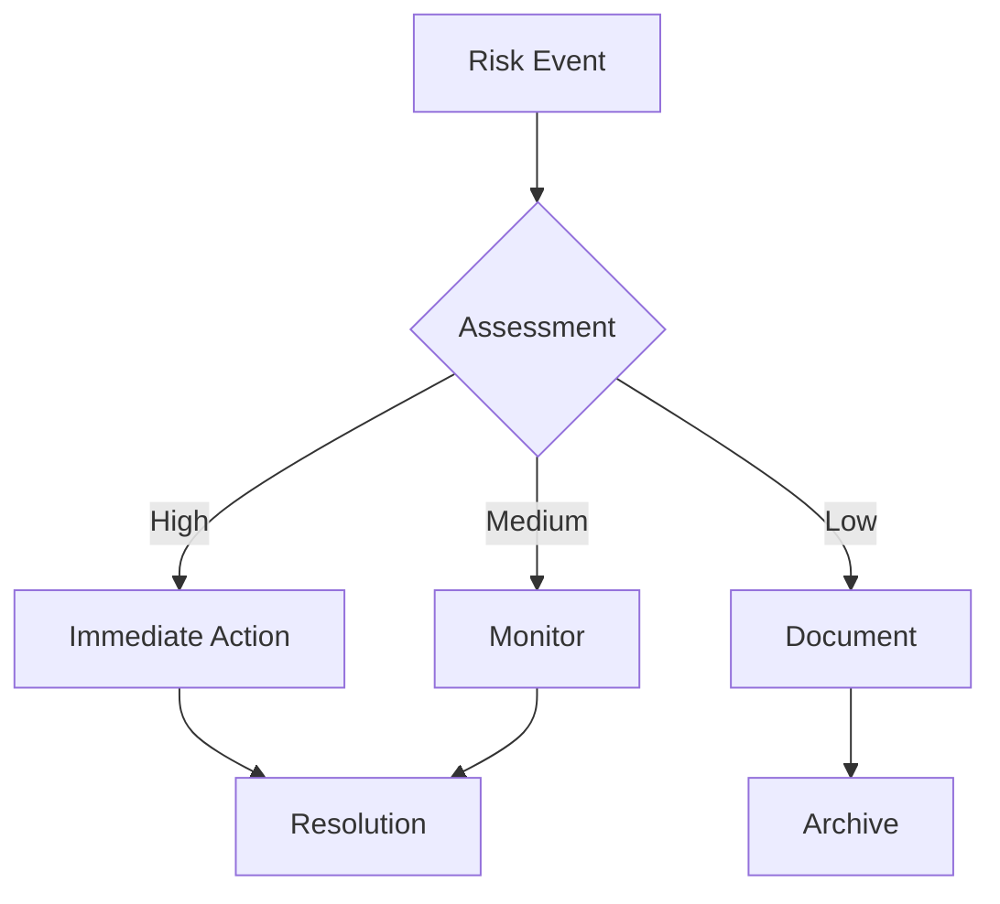
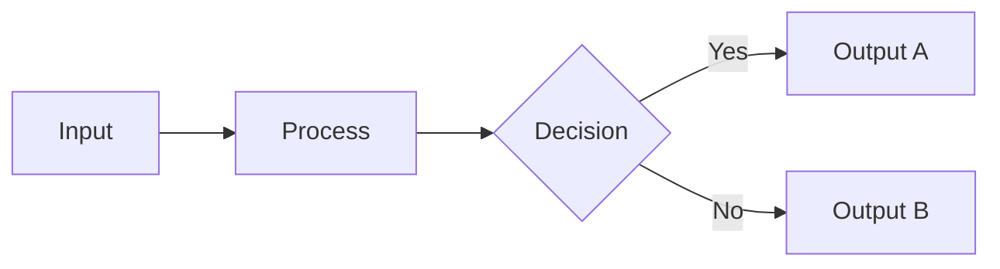
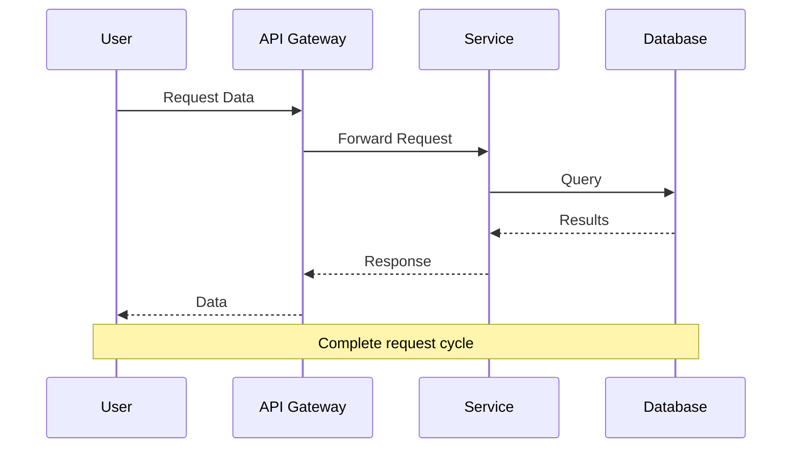
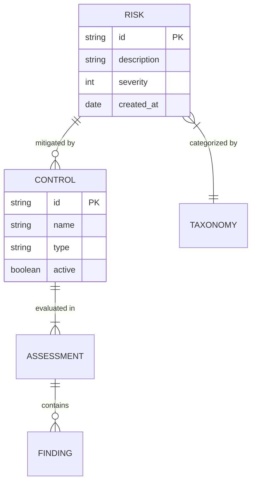
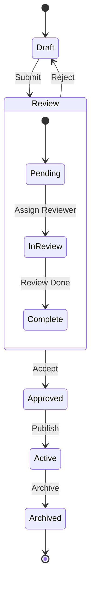
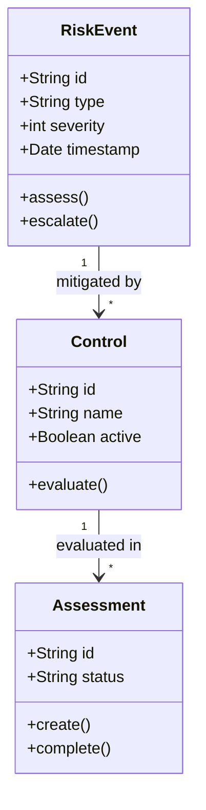
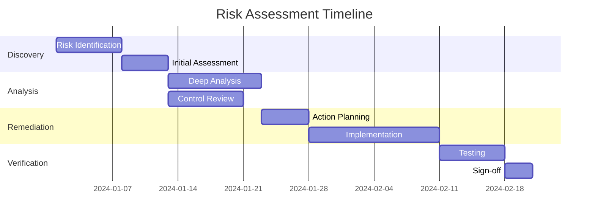
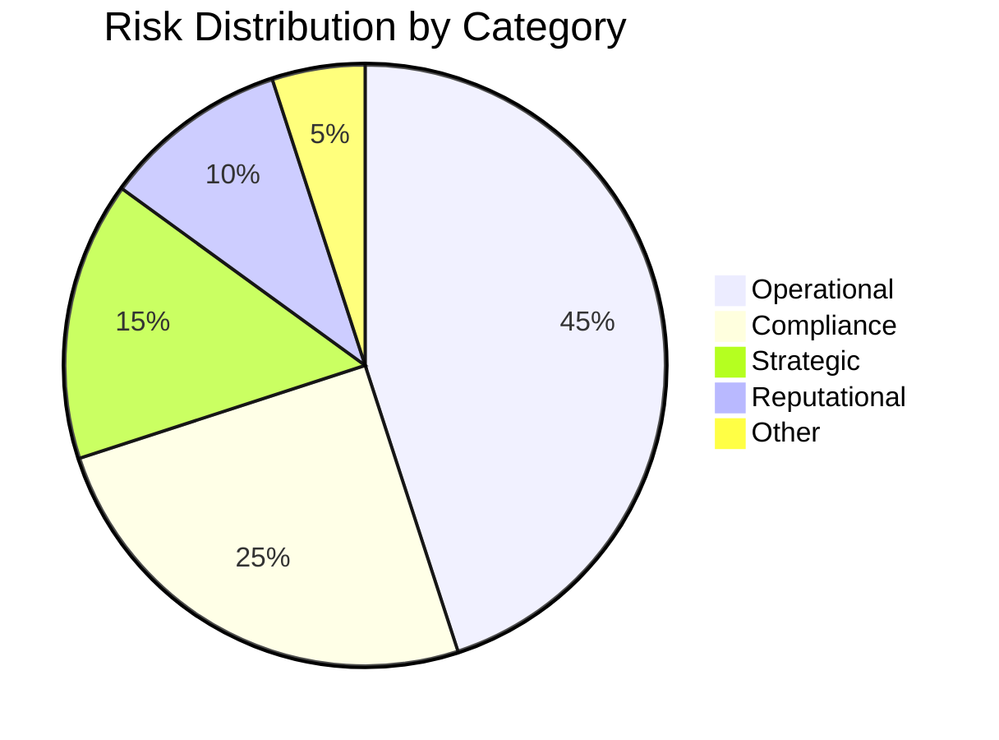
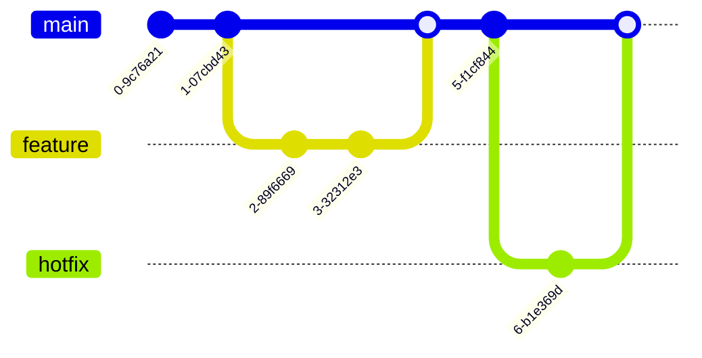

# Mermaid Diagram Examples

This page demonstrates various Mermaid diagram types supported in the documentation.

## Flowchart

### Basic Flowchart

### Horizontal Flowchart

## Sequence Diagram

## Entity Relationship Diagram

## State Diagram

## Class Diagram

## Gantt Chart

## Pie Chart

## Git Graph

:::info Mermaid Version
Diagrams are rendered using Mermaid.js. Some advanced features may require specific Mermaid versions. Check the [Mermaid documentation](https://mermaid.js.org/) for syntax details.
:::
