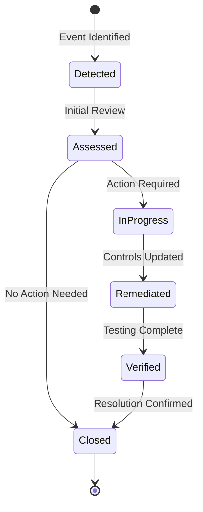

# Event Types

Risk events in NFR Connect are classified by type to enable consistent analysis and reporting.

## Event Classification

| Type | Description | Example |
|------|-------------|---------|
| Loss Event | Actual financial or operational loss | Trading error resulting in $50K loss |
| Near Miss | Potential loss that was avoided | Failed backup detected before data loss |
| Control Failure | Breakdown in control effectiveness | Unauthorized access attempt blocked |
| External Event | External factor impacting operations | Vendor service outage |

## Event Lifecycle



## Event Severity Matrix

Events are scored based on impact and likelihood:

| Likelihood / Impact | Low (1-2) | Medium (3-4) | High (5) |
|---------------------|-----------|--------------|----------|
| **Rare** | Low | Low | Medium |
| **Unlikely** | Low | Medium | Medium |
| **Possible** | Medium | Medium | High |
| **Likely** | Medium | High | High |
| **Almost Certain** | High | High | Critical |

<Warning title="Severity Escalation">
Events classified as **High** or **Critical** trigger automatic escalation to the Risk Committee and require remediation within 48 hours.
</Warning>

## Event Ingestion

Events can be ingested through multiple channels:

1. **Manual Entry** - Through the NFR Connect Dashboard
2. **API Integration** - Programmatic submission via REST API
3. **Automated Detection** - From monitoring systems and log analysis

```json title="Event payload structure"
{
  "type": "LOSS_EVENT",
  "severity": 3,
  "description": "Unauthorized transaction processed",
  "taxonomy_code": "OPR-002-001",
  "detected_at": "2024-01-15T10:30:00Z",
  "business_unit": "Trading Operations"
}
```
